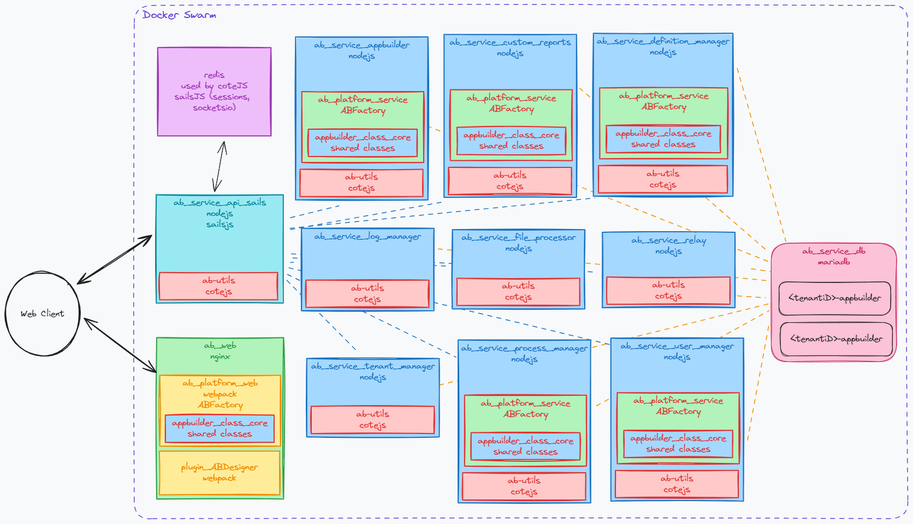

AppBuilder implements an Microservice Archtecture with a number of containerized services. Services are run in docker containers, typically deployed through docker swarm.
Services are typically written in NodeJs based off of the nodejs docker image.

## AB Services

### [ab_service_api_sails](https://github.com/CruGlobal/ab_service_api_sails)
This is the main api gateway for AppBuilder. It uses [sailsjs](https://sailsjs.com).
Here we process incoming requests, including authentication and resolving the tenant. The actually request is then passed off to one or more service to do the actual work.

Documentation on our api endpoints can be fount in the [README](https://github.com/CruGlobal/ab_service_api_sails?tab=readme-ov-file#reference)

Sails can return tempalted html, but most of our html is served statically from `ab_service_web`.

### [ab_service_web](https://github.com/CruGlobal/ab_service_web)
This is our nginx web server. It's based on the [nginx docker image](https://hub.docker.com/_/nginx/). It serves static assets, including the majority of our html.

We maintain both a `master` and `develop` branch of `ab_service-web`, both get built into docker images. The main difference is in the webpack build. `master` contains compressed and minified code, while `develop` is uncompressed and unmimified. `master` should be production ready code.

#### [ab_platform_web](https://github.com/CruGlobal/ab_platform_web)
This is the main framework for displaying AppBuilder in a web browser. It will create a factory (`ABFactory`) which use to generate the Apps based off of the definitions and handle most functions including communication with the server. The web platform extends `appbuilder_classes_core`.

The main UI framework we use is [Webix](https://webix.com/).

#### [plugin_ABDesigner](https://github.com/CruGlobal/plugin_ABDesigner)
This is a core plugin that enables users with Builder permission, to create and edit Apps within the system. This, like all plugins, recieves the `ABFactory` from `ab_platform_web`.

### [ab_service_appbuilder](https://github.com/CruGlobal/ab_service_appbuilder)
This service handles operations that read and write data to/from the tenant's custom tables as defined in their app definitions.

### [ab_service_custom_reports](https://github.com/CruGlobal/ab_service_custom_reports)
This service renders and serves html reports. These include data from the tenant and custom buisness. It intended for reports or templates that are hard to model using the ABDesigner.
Reports are written as ejs templates and custom logic to get the necessary data.

### [ab_service_definition_manager](https://github.com/CruGlobal/ab_service_definition_manager)
This service manages the appbuilder defintions for each tenant. Definitions define many things including the display of each apps and the custom database tables. Typically definions are created and editied using the `ABDesigner` plugin.
Definitions are stored as JSON in the `appbuilder_definion` table.

### [ab_service_log_manager](https://github.com/CruGlobal/ab_service_log_manager)
This service maintains an audit log of data changes, including who changed what when. Logs are stored in the `SITE_ROWLOG` table.

### [ab_service_file_processor](https://github.com/CruGlobal/ab_service_file_processor)
The serivec manages uploaded files.

### [ab_service_process_manager](https://github.com/CruGlobal/ab_service_process_manager)
This service runs processes as defined in the definions. Process are modeled in the `ABDesigner` plugin, using [bpmn.io](bpmn.io) notation. Process manager will trigger and run various process tasks as defined.

### [ab_service_relay](https://github.com/CruGlobal/ab_service_relay)
This service decrypts and triggers reqeust that come in from a MCC relay servers. Response are encrypted before being sent out.

### [ab_service_tenant_manager](https://github.com/CruGlobal/ab_service_tenant_manager)
This service manages configuration settings for individual tenants.

### [ab_service_user_manager](https://github.com/CruGlobal/ab_service_user_manager)
This service manages users, including setting and verifying passwords.

### [ab_service_db](https://github.com/CruGlobal/ab_service_db)
This is a MariaDB database based off of the [official image](https://hub.docker.com/_/mariadb). It includes the basic schema for our `SITE_` tables, as well as the `appbuilder_definition` table. 
It also includes some data, for example, the definitions for our Site Adminstration App. Each tenant has it own database. 
The `SITE_` tables will have the same schema for each tenant, but tenants will also have custom generated tables based on theoir defintions.

Changes to our `SITE_` tables and basic `appbuilder_definions` are handled by [ab_migartion_manager](https://github.com/CruGlobal/ab_migration_manager), which applies ordered patches to new and existing databases.

## Shared Components
### [ab-utils](https://github.com/CruGlobal/ab-utils)
This is shared set of utilities used in each of our services. This is where implement [cote](https://cote.js.org/), which handles communication between our services.
`ab-utils` also includes the [`mysql`](https://www.npmjs.com/package/mysql) library for interacting with the database.

More details about the utilities is documented in it's [READNE](https://github.com/CruGlobal/ab-utils?tab=readme-ov-file#ab-utils).

We publish ab-utils to npm and included as a dependency in each service.

### [appbuilder_class_core](https://github.com/CruGlobal/appbuilder_class_core)
This is a shared set of clases that get extended in a different platforms. For example `ABFactoryCore` is defined here. `ab_platform_web` extends this as `ABFactory` to include specific functionality used only on the web.
`appbuilder_platform_service` also extends this and creates it's own `ABFactory` class which includes functionality needed on the server.

Note: Though not discussed here, this is also shared with `ab_platform_mobile` and `test_pwa` (experimental mobile platform).

### [appbuilder_platform_service](https://github.com/CruGlobal/appbuilder_platform_service)
This is a shared codebase used in many of our services. It many function is to create an `ABFactory` used by the service. An `ABFactory` is unique to each tenant, and will ensure that the correct database is used forany queries.
Currently we use [Objection.js](https://vincit.github.io/objection.js/) and [Knex.js](https://knexjs.org) to work with the Database.

## Other
### Redis

We run an instance of Redis. We run the official redis docker image. 

This is used by cote for service discovery.

It is also used sails as the session store and socket store.
