_Draft: Updated 01-Oct-2020_  
[Original Google Doc](https://docs.google.com/document/d/19MqSXec6je2YkFUOnr7c5pDhP9odYYbK3zI79XRqUEo/edit)

## Background

Most applications (such as WordPress) have a fixed database schema, which may change between versions. Using a WordPress install modifies the data inside the database but does not change the schema.

Since AppBuilder is intended for quickly building up applications from scratch, parts of the database schema are dynamically generated throughout the “building” of an application. This document attempts to explain how AppBuilder stores both the schema and data into the database, along with the general layout of the various backend components.

AppBuilder translates the database schema into Javascript Objects (see [ORM](https://en.wikipedia.org/wiki/Object-relational_mapping)). Because of this strong coupling between the database and the object model, certain parts of the source code map fairly directly to the database schema. We’ll start by taking a look at the layout of the source code.

## Source Code Layout

At initial glance, it seems that there are many duplicate files. For example,

```
app_builder/api/classes/core/ABObjectCore.js
app_builder/api/classes/platform/ABObject.js
app_builder/assets/opstools/AppBuilder/classes/platform/ABObject.js
app_builder/mobile/platform/ABObject.js
```

All four of these files have similar or identical names and seem to be associated with the AppBuilder Object. **_But why are there four files?_** What makes each one unique?

To understand this, take a look at the diagram below, and particularly the red outlined portion.

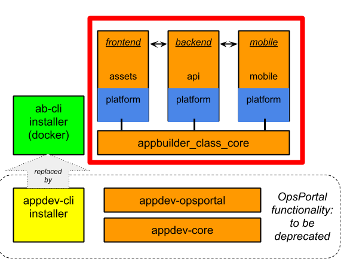

### Shared Layer

**appbuilder_class_core** is essentially a “refactored” piece that contains data structures that are common to many different contexts. Since both the front-end code and the back-end code use Javascript, this means that the same actual data structures can be used on both sides. Here, you’ll find a number of files that are named as such:

```
app_builder/api/classes/core/ABApplicationCore.js
app_builder/api/classes/core/ABDataCollectionCore.js
app_builder/api/classes/core/ABObjectCore.js
…
app_builder/api/classes/core/dataFields/ABFieldBooleanCore.js
app_builder/api/classes/core/dataFields/ABFieldDateTimeCore.js
…
app_builder/api/classes/core/process/ABProcessTaskManager.js
…
app_builder/api/classes/core/view/ABViewCore.js
app_builder/api/classes/core/view/ABViewPageCore.js
```

To put it simply, these files may be shared between the back-end, front-end, or mobile applications. As an example, the file `ABObjectCore.js` helps to define an object as something that contains varying kinds of data fields.

From here, each of the following can be understood as context-specific implementations of the files found in the core. Essentially, the core files are “wrapped” (included) by the various components and used in a context-relevant manner. See the following examples:

### Back-End Layer

**api/classes/platform** is the directory that is analogous to the back-end in the diagram above. Let’s take a look at the files available there:

```
app_builder/api/classes/platform/ABApplication.js
app_builder/api/classes/platform/ABObject.js
…
app_builder/api/classes/platform/process/ABProcessEngine.js
app_builder/api/classes/platform/process/tasks/ABProcessTaskEmail.js
…
app_builder/api/classes/platform/views/ABView.js
```

So, there are a number of files here that are back-end specific implementations. Here, <code>ABObject.js<strong> </strong></code>is wired up with database synchronization code, which is an obvious function of the back-end. It is generating SQL using [knex](http://knexjs.org/) and in some cases, [Waterline](https://sailsjs.com/documentation/reference/waterline-orm) (which is the ORM for Sails.js).

### Web Front-End Layer

**assets/opstools/.../platform** contains front-end code (as represented in the diagram above). Here’s a sampling of the files found there:

```
app_builder/assets/opstools/AppBuilder/classes/platform/ABApplication.js
app_builder/assets/opstools/AppBuilder/classes/platform/ABDataCollection.js
app_builder/assets/opstools/AppBuilder/classes/platform/ABObject.js
…
app_builder/assets/opstools/AppBuilder/classes/platform/dataFields/ABFieldBoolean.js
app_builder/assets/opstools/AppBuilder/classes/platform/dataFields/ABFieldDateTime.js
…
app_builder/assets/opstools/AppBuilder/classes/platform/process/tasks/ABProcessTaskEmail.js
…
app_builder/assets/opstools/AppBuilder/classes/platform/views/ABViewPage.js
app_builder/assets/opstools/AppBuilder/classes/platform/views/ABViewTab.js
```

To continue with our example, this version of `ABObject.js` describes the UI of working with an AppBuilder Object. This code implements a [Webix](https://webix.com/widgets/) representation of an AppBuilder Object, being able to cleanly present the data, as well as providing the interface for a user to be able to manipulate the data in an AppBuilder Object.

### Mobile Front-End Layer

```
*todo* describe mobile file layout

app_builder/...
```

**mobile/platform** also has `ABObject.js` , and this is a framework7 / [Cordova](https://cordova.apache.org/docs/en/latest/) specific implementation of an AppBuilder object.

### Source Code Layout Summary

`core/ABObjectCore.js` defines a **Javascript type**

Then each of the “platform” includes the core type, along with relevant concepts for the particular platform:

`api/platform/ABObject.js`: is **backend** code, so it translates ABOject into SQL using knex\
`assets/platform/ABObject.js`: is **frontend** code, so it includes webix view information\
`mobile/platform/ABObject.js`: is **mobile** code, so it includes Cordova view information

Thus, **appbuilder_class_core** provides a base data type, and each of the **platform** directories are like relevant implementation details for that datatype based upon the context (backend needs to talk to the database, frontend interacts with the user via web, mobile interacts with the user via mobile interface).

#### Back-end Wiring Code

> _**TODO:** describe some of files and mechanisms of Sails.js “wiring” up the app, such as routing, configuration, etc._

## Database Layout

AppBuilder uses **[MariaDB](https://mariadb.org/documentation/)** (a fork of MySQL) as it’s underlying database technology. Two databases are created and managed. These are summarized here and then presented in fuller detail below.

### Database: site

Generally speaking, the schema for this database does not change. This database contains the following information:

- _Complete App Layout (see appbuilder_definitions table below)_
  - object and fields that define an app
  - queries, data collections
  - all UI elements (interfaces/views)
- multi-tenant ready Roles & Scopes
- _OpsPortal_ (to be deprecated)
  - OpsPortal Users
  - OpsPortal Roles & Scopes

### Database: appbuilder

This database is a dynamic database layout, so the schema of this database changes during the use of the AppBuilder. Data that is generated through the use of an App is stored into this database.

### Setup & Initialization

When installing AppBuilder, the scripts that are used by the installer to perform initial setup are located in the appbuilder directory:

```
appbuilder/myqsl/init/

    01-CreateDBs.sql
    02-InitData.sql
    03-DefaultRoleScope.sql
```

## App Structure

An AppBuilder app has the following relational structure. At the topmost level is an **application**. The application contains lists of references to other entities: objects, queries, data collections, and interfaces (pageIDs). In the diagram below, different colors are used to illustrate the connections. In our diagram, we are using a generic name of _MyApp_.

Note that the **id** field of each is typically a lengthy computer generated UUIDs (e.g., `138ff828-4579-412b-8b5b-98542d7aa152`), but we are using user-readable representations (e.g., `app001`) to help illustrate the connections between the various components.
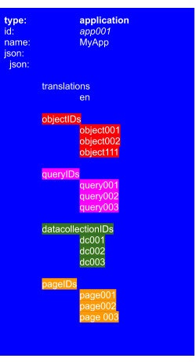
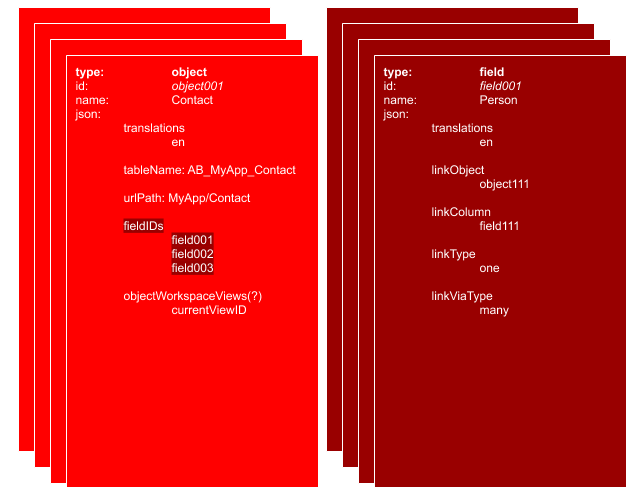

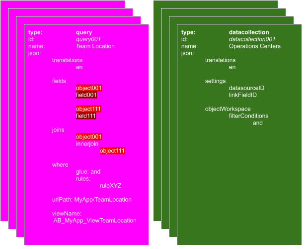
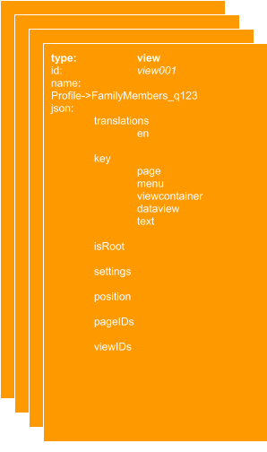

### **Objects**

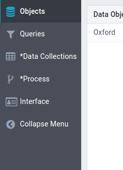

Each AppBuilder object is stored as its own table in the **appbuilder** database. For example, an AppBuilder object of the name _Contacts_ may exist as:

```
db:     appbuilder
table:  AB_MyApp_Contacts
```

Objects are referenced in two ways.

The first is by AppBuilder via the **appbuilder_definition** database, which provides the specific database table via the _json_ field, by the key _tableName_. This also describes the layout of the Object to the AppBuilder system.

```
appbuilder_definition
id:   138ff828-4579-412b-8b5b-98542d7aa152
name: Contacts
type: object
json: {
        "primaryColumnName": "uuid",
        "tableName": "AB_MyApp_Contacts",
        "urlPath": "MyApp/Contacts",
        "fieldIDs": [
          "f8ee19c3-554c-4354-8cff-63310a1d9ae0",
          "ee1f0cf9-bd0d-4cfa-9705-2bcf990e0c78",
          "9a8f7c67-8f2b-4173-ad94-4a02974bf4bd",
        ],
        "indexIDs": [
          "de5fb959-af33-40c5-b29e-50e57350e919"
        ]
      }
```

The FieldIDs listed above are all of the specific columns for a particular Object. In this example, The Contacts object contains three fieldIDs. By searching for those particular fieldIDs, we find that they correspond to the following fields:

```
"f8ee19c3-554c-4354-8cff-63310a1d9ae0" <- Name
"ee1f0cf9-bd0d-4cfa-9705-2bcf990e0c78" <- Number
"9a8f7c67-8f2b-4173-ad94-4a02974bf4bd" <- Email
```

This leads to the second way of referencing an AppBuilder Object. The data for each Object is stored in its own table.

Therefore, the SQL database representation of this Object would be as follows:

<table>
  <tr>
    <td><strong>Database: </strong>appbuilder
    <br>
    <strong>Table: </strong>AB_MyApp_Contacts
   </td>
  </tr>
  <tr>
   <td>
   <pre><code>varchar(255):   uuid
datetime:       created_at
datetime:       updated_at
text:           properties
varchar(255)    Name
varchar(255)    Number
varchar(255)    Email </code></pre>
   </td>
  </tr>
</table>

#### **Query**

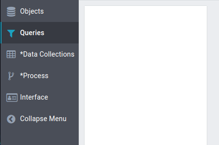\
Queries within the AppBuilder are stored as an SQL view, which act as virtual tables. Within the database, they are named as follows:

```
db:     appbuilder
view:   AB_AppName_ViewXYZ
```

#### **Data Collections**

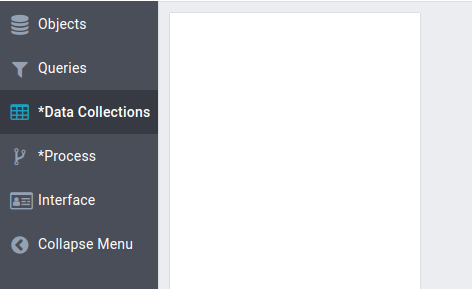\
Data Collections are subsets of data that are useful from within the front-end. Therefore, they **_do not exist_** as independent entities in the database. Instead, these are fully defined within the **appbuilder_definition** table, with the type field set to **datacollection**.

```
appbuilder_definition
id:         8b11ae98-4e20-4f3e-a110-061ba5d289bc
name:       City
type:       datacollection
json:       {_key: 8b11ae ...}
createdAt:  2020-09-24T20:56:18.000Z
updatedAt:  2020-09-24T20:56:18.000Z
```

#### **Process**

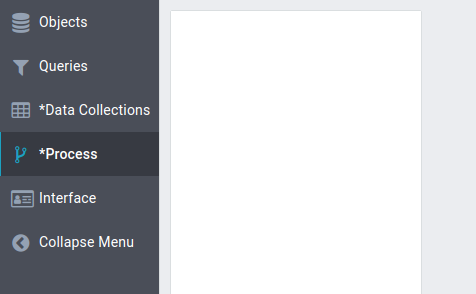

Processes do not exist in the database, and are only found within the **appbuilder_definition** table

_todo: verify process information_

#### **Interface**

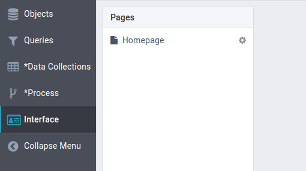

Interface is the same as a visual UI element, such as a page, in the AppBuilder. These are defined within the **appbuilder_definitions** table, with the type field set as **view**.

```
appbuilder_definition
id:         42f9165e-f9bd-4d92-a510-2fdfd22787a4
name:       MyApp_1200->Contacts List_a0h3
type:       view
json:       {id: 42f9165e ...}
createdAt:  2020-09-24T20:56:18.000Z
updatedAt:  2020-09-24T20:56:18.000Z
```

Note that the _key_ field within the json field may define specific UI elements such as :

- page
- menu
- viewcontainer
- dataview
- text

**_NOTE:_** It’s confusing! _AppBuilder Queries_ are stored as _SQL Views_. AppBuilder _interfaces_ are also named _views_ in this schema. Please be aware of the potential for confusion with varying and overlapping names!

## Database: site

> **_TODO:_** will this database potentially go away when OpsPortal is deprecated??

**_NOTE:_** The contents of `appbuilder_definition` can be (partially) pulled via the AppBuilder interface by hitting the gear icon (<span class='tag'></span>) for any given app, and selecting export (<span class='tag'></span>)

<table>
  <tr>
    <th><strong>Table: appbuilder_definition</strong></th>
  </tr>
  <tr>
    <td>
      <strong>Description:</strong>
      <p>
        This is one of the most important tables to understand. AppBuilder
        application relationships are all stored in this table. The
        relationships are defined within the <em>json</em> column.
      </p>

      <p>
        In order to "recreate" an app, you can look for rows of the type
        <strong>application</strong>. These are the most top-level items. The
        <em>json<strong> </strong></em>column describes the various
        relationships in the app, and contains references to other objects found
        within this table that are of the various <em>type</em> listed below.
        For a visual representation of this idea, please see the section
        <a href="#app-structure">App Structure</a>.
      </p>
    </td>

  </tr>
  <tr>
    <td>
      <strong>Code reference:</strong>
      <code>app_builder/api/models/ABDefinitionModel.js</code>
    </td>
  </tr>
  <tr>
    <td>
      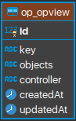<br />
      <strong>Fields:</strong><br />
      <em>id</em><br /><br />
      <em>name</em><br /><br />
      <em>type</em>:
      <ul>
        <li><strong>view,</strong></li>
        <li><strong>field,</strong></li>
        <li><strong>datacollection,</strong></li>
        <li><strong>application,</strong></li>
        <li><strong>object,</strong></li>
        <li><strong>field,</strong></li>
        <li><strong>query</strong></li>
      </ul>
    </td>
  </tr>
  <tr>
    <td>
      <strong>Example:</strong>
      <pre><code>id:   0475ad1e-9e18-41be-9e55-92b0962260eb
name: items Form.datepicker
type: view
json: {
    "type":"view",
    "key":"datepicker",
    "icon":"calendar",
    "settings":{
        "objectId":"94c3d748-e0dd-4bbd-bd2b-c574ce3a85d3",
        "fieldId":"15ab6c9a-0c25-4266-b204-3be76f062853",
    "translations":[{
        "language_code":"en",
        "label":"items Form.datepicker"
    }],
    "position":{
        "dx":"1",
        "dy":"1",
        "y":"1"
    },
    id":"0475ad1e-9e18-41be-9e55-92b0962260eb"
}
createdAt:	2020-09-07 10:14:14
updatedAt:	2020-09-07 10:14:14
</code></pre>
    </td>
  </tr>
</table>

<table>
  <tr>
    <th><strong>Table: site_multilingual_label</strong></th>
  </tr>
  <tr>
    <td>
      <strong>Description:</strong>
      <p>
        strings that are displayed in the AppBuilder interface of the UI
      </p>

      <p>
        "developer strings, not appbuilder strings"
      </p>
    </td>

  </tr>
  <tr>
    <td><strong>Code reference:</strong></td>
  </tr>
  <tr>
    <td><strong>Fields:</strong></td>
  </tr>
  <tr>
    <td><code>Example:</code></td>
  </tr>
</table>

## Database: appbuilder

Many of the tables in the **appbuilder** database are dynamically generated by the AppBuilder itself.

At a minimum, each of these contains the following columns:

```
  uuid,
  created_at,
  updated_at,
  properties
```

**_NOTE_**: Renaming objects in the AppBuilder after they have been created **does not result in the object being renamed in the database schema**. This can cause apparent inconsistencies when the new name no longer matches the original name in the database schema.

<table>
  <tr>
    <th><strong>Table: </strong>AB_SYSTEM_ROLE</th>
  </tr>
  <tr>
    <td>
      <strong>Description: </strong>
      <p>
        This table is a predefined table for managing AppBuilder roles. It is
        actually an AppBuilder Object.
      </p>
    </td>
  </tr>
  <tr>
    <td>
      <strong>Code reference: </strong><code>app_builder/api/systemObjects/role.js</code>
    </td>
  </tr>
  <tr>
    <td>
      <strong>Fields:</strong>
      <pre><code class='sql'>    `uuid` varchar(255) COLLATE utf8_unicode_ci NOT NULL,
    `created_at` datetime DEFAULT NULL,
    `updated_at` datetime DEFAULT NULL,
    `properties` text COLLATE utf8_unicode_ci DEFAULT NULL,
    `translations` text COLLATE utf8_unicode_ci DEFAULT NULL,
    `users` text COLLATE utf8_unicode_ci DEFAULT NULL,
    PRIMARY KEY (`uuid`)</code></pre>
    </td>
  </tr>
  <tr>
    <td><strong>Example:</strong></td>
  </tr>
</table>

<table>
  <tr>
    <th><strong>Table: </strong>AB_SYSTEM_SCOPE</th>
  </tr>
  <tr>
    <td>
      <strong>Description:</strong>
      <p>
        This table is a predefined table for managing AppBuilder scopes. It is
        actually an AppBuilder Object.
      </p>
    </td>
  </tr>
  <tr>
    <td>
      <strong>Code reference:</strong>
      <code>app_builder/api/systemObjects/scope.js</code>
    </td>
  </tr>
  <tr>
    <td>
      <strong>Fields:</strong>
      <pre><code class='sql'>    `uuid` varchar(255) COLLATE utf8_unicode_ci NOT NULL,
    `created_at` datetime DEFAULT NULL,
    `updated_at` datetime DEFAULT NULL,
    `properties` text COLLATE utf8_unicode_ci DEFAULT NULL,
    `translations` text COLLATE utf8_unicode_ci DEFAULT NULL,
    `createdBy` text COLLATE utf8_unicode_ci DEFAULT NULL,
    `objectIds` text COLLATE utf8_unicode_ci DEFAULT NULL,
    `filter` text COLLATE utf8_unicode_ci DEFAULT NULL,
    `allowAll` tinyint(1) DEFAULT NULL,
    PRIMARY KEY (`uuid`)</code></pre>
    </td>
  </tr>
  <tr>
    <td><strong>Example:</strong></td>
  </tr>
</table>

<table>
  <tr>
    <th>
      <strong>Table Template: </strong>AB_<strong
        ><em>{AppName}_{ObjectName}</em></strong
      >
    </th>
  </tr>
  <tr>
    <td>
      <strong>Description:</strong>
      <p>
        This table is dynamically generated and stores the data for an
        AppBuilder Object.
      </p>

      <p>
        An AppBuilder Object can contain a number of different "dataFields."
      </p>
    </td>

  </tr>
  <tr>
    <td>
      <strong>Code reference for the table:</strong>
      <pre><code>  app_builder/api/classes/platform/ABObject.js (<em>includes:)</em>
  app_builder/api/classes/core/ABObjectCore.js</code></pre>
      <p>
        <strong>Code reference for allowed data types:</strong>
      </p>

      <pre><code> app_builder/api/classes/platform/dataFields/ABFieldAutoIndex.js
  app_builder/api/classes/platform/dataFields/ABFieldBoolean.js
  app_builder/api/classes/platform/dataFields/ABFieldCalculate.js
  app_builder/api/classes/platform/dataFields/ABFieldCombine.js
  app_builder/api/classes/platform/dataFields/ABFieldConnect.js
  app_builder/api/classes/platform/dataFields/ABFieldDate.js
  app_builder/api/classes/platform/dataFields/ABFieldDateTime.js
  app_builder/api/classes/platform/dataFields/ABFieldEmail.js
  app_builder/api/classes/platform/dataFields/ABFieldFile.js
  app_builder/api/classes/platform/dataFields/ABFieldFormula.js
  app_builder/api/classes/platform/dataFields/ABFieldImage.js
  app_builder/api/classes/platform/dataFields/ABField.js
  app_builder/api/classes/platform/dataFields/ABFieldJson.js
  app_builder/api/classes/platform/dataFields/ABFieldList.js
  app_builder/api/classes/platform/dataFields/ABFieldLongText.js
  app_builder/api/classes/platform/dataFields/ABFieldNumber.js
  app_builder/api/classes/platform/dataFields/ABFieldSelectivity.js
  app_builder/api/classes/platform/dataFields/ABFieldString.js
  app_builder/api/classes/platform/dataFields/ABFieldTextFormula.js
  app_builder/api/classes/platform/dataFields/ABFieldTree.js
  app_builder/api/classes/platform/dataFields/ABFieldUser.js
  app_builder/api/classes/platform/dataFields/[template].js</code></pre>

</td>

  </tr>
  <tr>
    <td>
      <strong>Fields:</strong>
      <pre><code class='sql'>`uuid` varchar(255) COLLATE utf8_unicode_ci NOT NULL,
`created_at` datetime DEFAULT NULL,
`updated_at` datetime DEFAULT NULL,
`properties` text COLLATE utf8_unicode_ci DEFAULT NULL,</code></pre>
      <strong>Plus user-defined fields:</strong>
      <blockquote>
        TODO: create an object that contains every type (dataFields) and then
        extract the SQL from it to place here
      </blockquote>
    </td>
  </tr>
  <tr>
    <td>
      <strong>Example:</strong>
      <pre><code class='sql'> {
    "id": "f8ee19c3-554c-4354-8cff-63310a1d9ae0",
    "name": "Name",
    "type": "field",
    "json": {
        "id": "f8ee19c3-554c-4354-8cff-63310a1d9ae0",
        "key": "string",
        "icon": "font",
        "isImported": "0",
        "columnName": "Name",
        "settings": {
            "showIcon": 1,
            "required": 0,
            "unique": 0,
            "validationRules": "[]",
            "default": "",
            "supportMultilingual": 0,
            "width": 319
        },
        "translations": [{
          "language_code": "en",
          "label": "Name"
        }]
    },
    "createdAt": null,
    "updatedAt": "2020-09-24T20:57:51.000Z"
  }</code></pre>
    </td>
  </tr>
</table>

<table>
  <tr>
    <th>
      <strong>Table Template:</strong> AB_<strong>
      <em>{AppName}_View{QueryName}</em></strong>
    </th>
  </tr>
  <tr>
    <td>
      <strong>Description:</strong>
      <p>
        AppBuilder Query - stored as a SQL view.
      </p>
    </td>
  </tr>
  <tr>
    <td>
      <strong>Code reference:</strong>
      <p>
        <code>??</code>
      </p>
    </td>
  </tr>
  <tr>
    <td><strong>Fields:</strong></td>
  </tr>
  <tr>
    <td>
      <strong>Example:</strong>
      <pre><code>AB_AccountingApp_ViewAccount
    Prefix: AB
    App: AccountingApp
    Query: Account</code></pre>
    </td>
  </tr>
</table>

<table>
  <tr>
    <th>
      <strong>Table Template: </strong>AB_JOINMN_<strong>
        <em>{Object1}_{Object2}_{}</em></strong>
    </th>
  </tr>
  <tr>
    <td>
      <strong>Description:</strong>
      <p>
        This a field in an AppBuilder Object of the "connect" field type, which
        references data from another object
        <br /><strong>AB</strong> application name <br /><strong>
          JOINMN </strong>keyword <br /><strong> User </strong>table name <br /><strong>
          Team </strong>linked table name <br /><strong> Team </strong>column name
      </p>
    </td>
  </tr>
  <tr>
    <td>
      <strong>Code reference:</strong>
      <p>
        <code>??</code>
      </p>

      <p>
        <code> api/classes/platform/dataFields/ABFieldConnect.js </code>
      </p>
    </td>

  </tr>
  <tr>
    <td><strong>Fields:</strong></td>
  </tr>
  <tr>
    <td><strong>Example:</strong></td>
  </tr>
</table>
