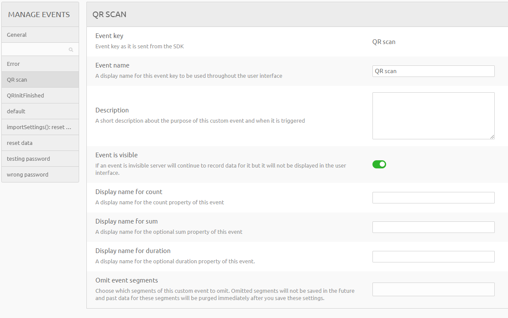

## Overview

! This is a first draft, how this works may change soon !

Using sentry and countly to track errors on mobile

Note: (as of Jan 2022)
Countly doesn't show specific data related to a sent message/error (No username or IP address)
Sentry should not be sent sensitive data as it is outside our security.

## JS pages

first
import analytics from "../../resources/Analytics.js";
or if you are on one of the app.js:
"../../platform/resources/Analytics.js";

Then use this to call the event
analytics.<call-type>("<name you want displayed>");
ex:
analytics.event("QR scan");
analytics.logError(err);

## HTML pages

These do not have to import analytics. Just use:

this.$root.analytics.<call-type>(<data>);
