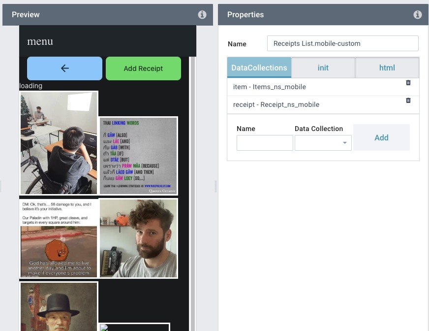

## Overview

this is WIP, example code 


this is what is running in the other tabs:

## Init
Load DCs in the second tab "init":
```
let a = ["receipt", "item"] // the names you set in the last tab
let promises = []
for (let index = 0; index < a.length; index++) {
   const dc = $DC[a[index]];
   promises.push( $AB.$store.dispatch("getAppBuilderData", dc.id) )
   promises.push( await $AB.$store.getters[dc.id] )
}
await promises
```
## HTML

```
function displayItem($h, item) {
   // This serves to inform us whether an item is currently selected: (remove in production)
   let $inputElement = $h`<div>loading</div>`;
   if (item["Description"]) {
      $inputElement = $h`<p>
      ${item["Description"]}: ${item["Amount"]}
      </p>`;
   }
   return $inputElement;
}
function inputElement($h, item) {
   let $inputElement = $h` toggleInItem(item.uuid)}
      ></img>`;
    return $inputElement;
}
dcreceipt = $DC["receipt"]
dcitem = $DC["item"]
let dcreceipt_data  = $AB.$store.getters[dcreceipt.id]

let selectedItem = {}
try {
   selectedItem = dcitem.getCursor() || {}
} catch (err) {
   console.log("getCursor always fails the first few times the data loads: ", err)
}

const inItem = (receiptID) => {
   if (selectedItem == undefined || selectedItem.Receipt == undefined) {
      return ""
   } else if (selectedItem.Receipt.includes(receiptID)) {
      return "border: 15px solid green;"
   }
   return "";
}
// return style formatting if id included in item's images
const toggleInItem = (receiptID) => {
   const receipt_data = $AB.$store.getters[dcreceipt.id].value.find(x => x.id === receiptID)
   if (selectedItem.id == undefined) {
      return ""
   } else if (selectedItem.Receipt.includes(receiptID)) {
      // remove from item
      selectedItem.Receipt = selectedItem.Receipt.filter((item) => item != receiptID);
      selectedItem.Receipt__relation = selectedItem.Receipt__relation.filter((item) => item.id != receiptID);
      // remove from receipt
      receipt_data["NS Report Items814"] = receipt_data["NS Report Items814"].filter((item) => item != selectedItem.id);
      receipt_data["NSReportItems814__relation"] = receipt_data["NSReportItems814__relation"].filter((item) => item.id != selectedItem.id);
   } else {
      // add to item
      selectedItem.Receipt.push(receiptID);
      selectedItem.Receipt__relation.push( receipt_data);
      // add to receipt
      receipt_data["NS Report Items814"].push(selectedItem.id);
      receipt_data["NSReportItems814__relation"].push(selectedItem);
   }
   dcitem.model.update(
      selectedItem.id, 
      {"Receipt": selectedItem.Receipt}
   )
   dcreceipt.model.update(
      receiptID, 
      {"NS Report Items814": receipt_data["NS Report Items814"]}
   )
   return $custom_page
}

const $custom_page = $h`
<!-- link buttons -->
<div class="block" style="margin-top: 0" >
   <div class="row">
      <div class="col" style="min-width:49%; float: left">
         <a href="#"
            data-cy="editreportButton"
            class="button button-large button-fill link back ripple-inset" >
            <i class="icon icon-back"></i>
         </a>
      </div>
      <div class="col-auto" style="min-width:49%; float: right;">
         <a href="/add_receipt"
            data-cy="receiptaddButton"
            class="button button-large button-fill color-green ripple-inset" >
            <t>Add Receipt</t>
         </a>
      </div>
   </div>
</div>
${displayItem($h, selectedItem)}
${dcreceipt_data.value.map((item) => inputElement($h, item))}
`
return $custom_page
```