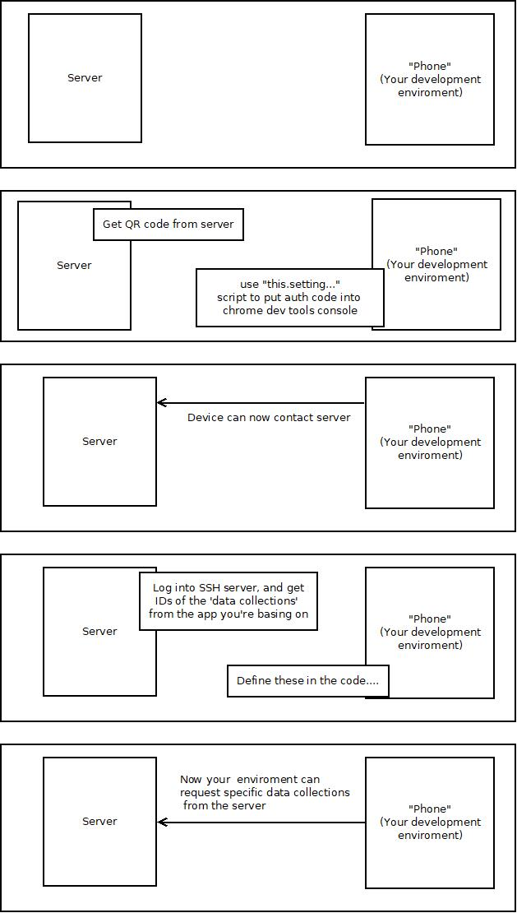

## Overview

AppBuilder data can be accessed on the Cordova mobile app through the `ABObject` and `ABDataCollection` classes. These classes know how to request data from the server through the ABRelay system and then store their respective info into the device's local storage.

An ABObject on the mobile framework represents an AppBuilder Object on the server. Each ABObject knows how to take its local data out of storage, and then later push any changes to it back to the server. (Storage is handled locally on the mobile device by an encrypted asynchronous key-value system with an SQLite back end. It is distinct from `localStorage`, which is a plaintext synchronous key-value system native to JavaScript.)

An ABDataCollection is usually an ABObject with a filter applied, but it can also be based on an AppBuilder Query that combines several Objects and their specific WHERE clauses. DataCollections are created on the AppBuilder server using its web interface. They are read-only. Changes made to data from DataCollections can be saved to the server using ABObjects. ("You can request the object from the `DataCollection.datasource.model().remote()` if that is what you have a reference to.")

Every ABObject and ABDataCollection item has a unique ID. You will need to know these IDs to use them in the mobile framework. The way to find out their IDs is by manually searching through the ABApplication's JSON text field in the server's database.


### Terminology

We might sometimes refer to things here with names that normally mean something else in a different context.

 - **Object**: This usually means an AppBuilder Object, or *ABObject*, and not just a JavaScript object `{}`.
 - **Application**: This usually means an AppBuilder Application, or *ABApplication*, and not the Cordova application or Framework7 app object. There can be multiple ABApplications within a single Cordova app.
 - **MobileApp**: This usually means *ABMobileApp*, which is a class used to manage the functionality of an *ABApplication* on the actual Cordova app on the mobile device.

## Mobile Framework

Here is a basic outline of how the mobile app is structured.
```
/
/www/
/www/index.html
/www/index.js
/www/lib/
/www/lib/app/
/www/lib/app/controllers/
/www/lib/app/controllers/appPage.js
/www/lib/app/templates/
/www/lib/app/applications/
/www/lib/app/applications/ABAPPNAME/
/www/lib/app/applications/ABAPPNAME/app.js
/www/lib/app/applications/ABAPPNAME/templates/
```

Like most Cordova apps, `index.html` is the starting point where loading begins. This loads the basic CSS and global .js files used by the application. We use Webpack to compile the rest of the JavaScript code into a packaged bundle. The entry point for this bundle is `index.js`, but most likely you will find `appPage.js` as a more useful point to begin as that is where most of the relevant parts of the application, including Framework7, gets initialized.


## Framework7

Framework7 is a JavaScript based framework and UI library for mobile apps. We make use of its UI widgets as well as its page routing and navigation system. Each of our app's Framework7 pages is a *component* that has its own .html file. The file is usually made up of two or three sections: the HTML `<template>` section that builds the look of the page, the `<script>` section that drives the functionality taking place on it, and (less commonly) a `<style>` section for any CSS  that is specific to the page.

```html
<style>
    .page .page-content p {
        font-size: 110%;
    }
</style>

<template>
    <div class="page">
        <div class="page-content">
            {{#if showMessage}}
                <p>{{message}}</p>
            {{/if}}
        </div>
    </div>
</template>

<script>
    return {
        data: function() {
            return {
                showMessage: true,
                message: "Hello World"
            }
        },

        on: {
            pageInit: function() {
                ...
            },

            pageBeforeIn: function() {
                ...
            },

            pageBeforeRemove: function() {
                ...
            }
        }
    }
</script>
```

### Async Data

The Framework7 component `<template>` populates the page's data from the `data()` function in the `<script>` section. Originally, this function could only return its value synchronously, and you may see some older applications designed around this limitation. For example, all the AppBuilder data had to be ready before the Framework7 page even started to load and the user was prevented from viewing the page until the data was ready. In more recent versions of Framework7, the `data()` function can now also return a Promise that resolves with the data. Both async and sync are supported.
```javascript
data: function() {
    var data = {
        label: "Image caption",
        imageURL: null
    };
    return new Promise((resolve) => {
        camera.loadPhotoByName("somePhotoName")
            .then((photo) => {
                data.imageURL = photo.url;
                resolve(data);
            })
    });
},
```

### No Imports

A limitation of Framework7 component scripts is they cannot import external libraries on their own. Still, they do have access to anything that is global, and a bunch of useful stuff is also available through the `this` object. You may be wondering about `this.$root`. This refers to data that was passed in when initializing Framework7. Somewhere in the `appPage.js` contructor, you will find something a bit like this, where the `data` parameter is passed in:

```javascript
this.applications = ABApplications;

...

this.app = new Framework7({
    ...
    data: () => {
        return {
            ...
            getMobileApp: (name) => {
                return this.applications.find((a)=>{ return a.id == name; });
            },
            ...
        }
    },
    ...
});
```

That is how we bring the ABMobileApp, ABApplication, and ABObject into the Framework7 template.


## ABMobileApp

In the mobile framework, the ABMobileApps are located in `/www/lib/app/applications`. Each application has its own subdirectory there. Within each subdirectory, there should at least be a few core files:

- `app.js`: This is the controller that defines how the ABMobileApp will function. This is the controller that initializes ABObjects and ABDataCollections, and keeps a working copy of their data in the ABMobileApp object itself.

- `config_app.js`: This is basically a data dump of the ABApplication's row from the server database. The mobile framework will reference its `json` property.

- `routes.js`: This defines the Framework7 page routing for the ABApplication on the mobile device. Typically, the routes will point to .html files in the `templates` subdirectory for the various component pages.

There are also various other files for managing the various ABObject types used by the application. For example, the Events application has `objEvent.js`, `objRegistration.js`, `objSubEvent.js`, and so on. These are all sub classes of `objBase.js`. (I assume that the 'obj' refers to their purpose of controlling ABObject data.)
```
/data/www/lib/app/applications/events/objBase.js
/data/www/lib/app/applications/events/objEvents.js
/data/www/lib/app/applications/events/objSubEvents.js
/data/www/lib/app/applications/events/Registration.js
```

These class objects initialize their data from the ABMobileApp's working copy data. They each have `.createLocal()`, `.updateLocal()`, and `.deleteLocal()` methods that you can use to persist data to local storage. ("And then automatically update the data in the main App".) These objects also have a `.save()` method that will sync the current state of their ABObject data to the ABRelay server. These methods are defined in `objBase.js`, and can be overridden by the sub class.

### To Do

One of the gotchas we have to work around right now is that ABObject data primary key `id` values are only generated on the server when the object is first saved. ABObjects often have connections with other ABObjects within the same application, and they reference each other by their `id`. The problem arises when you have to create a bunch of related objects on the mobile app at the same time. Their `id` values are not known until they are saved to the server, but they still need to reference their related objects somehow. So the mobile clients add a client-generated `uuid` field to the ABObject data, and keep everything connected using that. However, we have to do a little dance with the server to submit a base record, then receive its `id` value, and then update all the connected objects with that record's `id`. This is one of the first things Johnny wants to change in the framework once we get a chance.


## Example: Events App

What we've done for our Events app, is to create a local platform object for each of our ABObjects that we want to work with on the server. So there is a local objEvent, objRegistration, etc. that also matches up with the defined ABObject for the Event and Registrations on the server.

In the `/www/lib/app/applications/events/app.js` you'll see this:
```javascript
// a lookup of our local data and the object .id in our AB json
var ObjHash = {
    "Events": "d16ac465-5a1f-429e-809c-e3d05d43a2e6",
    "Registrations": "8504e326-a0b4-4300-9657-930f4832f6eb",
    "Registrants": "e0b32645-71d1-451b-8de0-40cb4b6e5ae7",
    "Charges": "ae08ab76-9202-4346-9738-31a7af2cfece",
    "Fees": "b4df10a0-cffc-4578-8b39-742641042acd",
    "SubEvents": "fe0f5a03-096e-49fd-9884-51e59e2b3955",
    "Schedules" : "4351f546-66e5-4354-be35-d16bb30bb837",
    "Photos" : "1365f52c-473a-4118-a9de-7e20ecb7c1d0"
}
```
definition that matches a local key to an `ABObject.id` that is defined in the `config_app.js`


In the `.initializeLocalData()` method of the `app.js`, you'll see we go through each of these definitions, and load up the local data into the App object.
```javascript
initializeLocalData() {
    var allOperations = [];

    //// Normal Data lookups:
    //// load our working data from our local storage
    for (var o in ObjHash) {
        allOperations.push(this.lookupData(ObjHash[o], o));
    }

    return Promise.all(allOperations);
}
```


During this process, each key in the `this.lookupData(id, key)` then becomes a:  
- `App.obj[Key]`: reference to the ABObject
- `App.data[Key]`: reference to the local data for this ABObject
- `App.get[Key]`: returns the local data
- `App.refresh[Key]`: a method to reload the data from local storage


When one of the local objObjects is created, it stores it's "Key" that matches what was used in the app.js process.  For example in `objRegistration.js`:
```javascript
export default class Registration extends OBJBase {

    /**
     * @param {object} data
     * @param {OBJEvent} event
     */
    constructor(data, event) {

        super(data, event.mobileApp(), "Registrations");
```
passes "Registrations" to its objBase app and "Registrations" matches the key defined in the `ObjHash`.

Once we have this working copy, we can access it in a synchronously, and we can then provide this data to the Framework7 component script `.data()` function to populate the template with it.

Now the `.initializeRemoteData()` function is supposed to initiate a call to the ABRelay server and get the data from there.  You'll notice that in here we don't simply do what we did in the `.initializeLocalData()` and just go through each object directly and request all the data.  Because if we did that, we would get all the data in those tables downloaded to the mobile client, and not just the data for the individual user.

So, we take those tables that are expected to be fully downloaded, and request a full download of those:
```javascript
// these are the system data objects we need to just get all the
// data from:
var remoteLookupObjects = ['Events', 'Fees', 'SubEvents'];
remoteLookupObjects.forEach((rlo)=>{
    allOperations.push(this.lookupDataRemote(ObjHash[rlo], rlo));
})
```

Then we step through and use DataCollections, to download only the subset of the data for the current user:
```javascript
// There is a MyExistingRegistration DataCollection that will return
// the user's Registration, Registrants, and Charges data :
allOperations.push(
    this.dcRemote(ID_DC_EXISTINGREGISTRATIONS,"MyExistingRegistrations")
    .then((data)=>{
        return this.populateExistingRegistrations(data);           
    })
)
```

In this example, a requested Registration object comes populated with its connected data, so we have a special `.populateExistingRegistratios()` method to pull out the connected data, and store it all locally.  

So in your App, you'll want to create a Datacollection for use by the user that will condition the ABObject data according to which user is using the app.

So now in your Framework7 template files, you can access the App object, and then get the local Obj that represents your data:
```javascript
var hris = this.$root.getMobileApp('HRIS');
var familyData = hris.getFamilyData();
```

And then these local Objs have methods that support the templates:
```javascript
var orderedList = familyData.getOrderedList(myRenID);
```

## And So Can You

So, if you wanted to follow this same pattern, I'd start by:

- Adding a `ObjHash = { 'key' : 'ABObj.uuid' }` in your app.js.
- Loading each of these in your `.initializeLocalData()`  method.
- Make sure each of our local objective.js, pfs.js, etc...  has the same key as in `ObjHash`.
- Then in `.initializeRemoteData()` figure out which objects you can download all data, and which ones require a DataCollection to limit to the current user.
- Make those requests there.
- Make sure your App is in `.status == 'ready'`  before going to your template file.
- In your template file, start requesting your local objects and asking them for their data there.

## quick example diagram

Note, this is two seperate movements
user's QR code from Server to Mobile
Server's list of Data collections from Server to Mobile\



Note that {{if}} can do basic compares, if you need comparison of objects, use {{js_if}}
