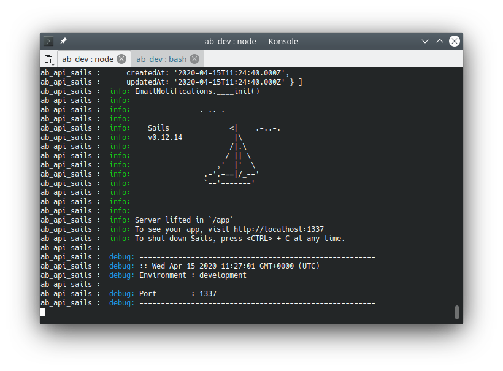

<!-- 

 -->



## Preparation

### Installing Docker

1. Create a docker account at [https://www.docker.com/](https://www.docker.com/)
1. Install docker client for your OS
   - [Linux (Ubuntu-based distributions) use docker’s repository](https://docs.docker.com/engine/install/ubuntu/)
   - [Windows (using WSL2)](https://docs.docker.com/docker-for-windows/wsl/)  
     
     These instructions work from Windows, no need to run within a Linux shell. The other steps are already included above
     - - Install wsl, update wsl to version two, create unix user
     - - Make docker account/ install docker
     - - VSCode + 'Remote - WSL extension.'
     - - Install Windows Terminal, run all future commands in Linux shell
         
   - [Mac](https://docs.docker.com/docker-for-mac/install/)
1. Create a docker swarm:

   ```bash
   docker swarm init --advertise-addr {my.ip.addr.ess}
   ```

### Installing node.js and NPM

It is recommended to use a node version manager to install node.js & npm. Two well- known version managers are [nvm](https://github.com/nvm-sh/nvm#node-version-manager---) and [n](https://github.com/tj/n#n--interactively-manage-your-nodejs-versions). These managers allow you to install multiple versions of node/npm, to switch between them easily, and to avoid “global installs” (which would necessitate sudo/root access).

#### Linux, Mac:

First, run the nvm install script from the link above (curl or wget). Afterward, you may have to configure your current shell environment:


```bash
bash source ~/.bashrc
```

Execute the following command, to install both node and npm:

```bash
nvm install node
```

Alternatives (nodesource) to using a node version manager:

[Downloading and installing Node.js and npm](https://docs.npmjs.com/downloading-and-installing-node-js-and-npm)

#### Windows:

See [nvm-windows](https://github.com/coreybutler/nvm-windows)

## Install the AppBuilder

Install our [ab-cli](https://github.com/CruGlobal/ab-cli) tool. One of it's functions is to install the AppBuilder, optionally with the developemnet environment. Use the following command:

```bash
npm install -g CruGlobal/ab-cli
```

Then, run the installer. Specify your own target directory in place of `{install_dir}`, for example:

```bash
appbuilder install {install_dir} --develop
```

**Option Definitions**

- `--develop`: executes git clone commands to bring down the source code

**Recommended Settings**

This installer will ask the following prompts.

```plaintext
? What Docker Stack reference do you want this install to use: ab
? What port do you want AppBuilder to listen on (80): 8080
? Do you want to expose the DB : Yes
? What port do you want the DB to listen on: 3306
? Enter the password for the DB Root User? root
? Which Docker Tags to use [master, develop, latest]: latest
? Authentication type: login
? Enter the URL for the auth service redirect: http://localhost:8080
? Do you want to enable the RELAY service : No
? Enter the Tenant Administrator Username: admin
? Enter the Tenant Administrator password: admin
? Enter the Tenant Administrator email: admin@email.com
? Enter the Tenant Administrator URL: http://localhost:8080/
```



## Starting AppBuilder

Run UP.sh

```bash
cd {install_dir}
./UP.sh -d
```

When you see the following screen, it means that the AppBuilder stack has successfully loaded.
\
In a browser open:

[`http://127.0.0.1:{port_number}`](http://127.0.0.1)

## Additional Information

If using `--develop flag`, the various code repositories will be located at: `{install_dir}/developer/`

Frontend code is found in `/developer/ab_platform_web` and `/developer/plugins/ABDesigner`. 
These repositories use webpack and compile to `/developer/web/assets`. 
To see changes to the code live use `npm run watch` in each repository.

## Files That You Should Know About
Config file: `{install_dir}/.env` - This will be generated based on your answers during the install

Docker production environment configuration file: `{install_dir}/docker-compose.yml`

Docker development environment configuration file: `{install_dir}/docker-compose.dev.yml`

Convenient helper - bring up all AppBuilder Docker services: `{install_dir}/UP.sh`

Convenient helper - shut down all AppBuilder Docker services: `{install_dir}/Down.sh`

Convenient helper - restart a single AppBuilder Docker service: `{install_dir}/restart.sh {docker_service_name}`

Convenient helper - enter a docker shell session: `{install_dir}/cli.sh`

## Windows notes:

Sometimes .sh files will fail this may be because the line ending was set to CRLF
To check this, look at the bottom right hand corner of your IDE when suspect .sh file is open

If this fails,
https://github.com/microsoft/WSL/issues/5923
"An error occurred mounting one of your file systems. Please run 'dmesg' for more details."
WSL may be set to wrong default. Try running 'bash' or 'wsl'
If they fail:
"wsl -l to discover this and wsl -d <myDistro>to explicitly select the distro "
"the command to set the default is wsl -s <myDistro>."

# E2E Testing

The following explains how to work with our E2E tests.

## Install Tests:
Use the ab-cli tool to install tests. From your install directory run:


```bash
appbuilder test add
```

Use space to select which tests to install, then Enter.

## Run Tests:
There are two main options for running the tests

1) Run the test in a test stack:


```bash
npm run test:boot
```
Since the test will reset the database, this is recommeneded if you keep test data in the main stack.

2) Run the test in the main stack

```bash
`./UP.sh -dt`
```

To acually run the test launch cypress with the command:
```bash
npm run cypress:open
```
Follow the on screen prompts to start and E2E test file.

Test can also be run headless as well with `npm run test:e2e`


Note: If you have any trouble, you may need to update the environment variable in `.env`. Look for the `CYPRESS_*` variables.  

