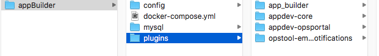

[< Develop](../../Develop.md)

# Setup Your Development Environment

In order to develop for the AppBuilder, you need to install the following packages:

- [Git](https://git-scm.com/downloads)
- [Docker](https://docs.docker.com/install/)
- [NodeJS](https://nodejs.org) (v6.x)

First, make sure you download and install [Docker](https://docs.docker.com/install/) and [Git](https://git-scm.com/downloads). Then download the appropriate [NodeJS](http://nodejs.org/download/) package and install it. Once that is done, you will also have a command line tool called `npm`

> Note: Windows users will need to run their command line tool in Administrator mode. After you install Git, you should have access to **'Git Bash'**. Right click on the icon (probably on your desktop), and select "run as administrator".
> Note: **If your using a unix environment,** I'd recommend taking a moment to read through [this article](https://www.sitepoint.com/beginners-guide-node-package-manager/) and see how they setup npm to not require using `sudo`. (it is the section called `Changing the Location of Global Packages`) While not necessary, it could save you some additional headaches.

The rest of the setup can be done from the command line.

Continue by installing our command line helper:

```sh
$ npm install -g appdevdesigns/appdev-cli
```

Now we simply need to run the appdev install tool:

```sh
$ cd your/development/directory
$ appdev dockerInstall appBuilder
    # you can name the directory anything, but in our examples we will use 'appBuilder'
```

This will create an appBuilder/ directory with everything needed to start up our docker install.


[todo: discuss the directory][todo: start chrome debugger ]
[todo: command to start Docker and watch loading progress in Chrome Debugger]
