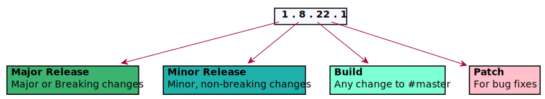
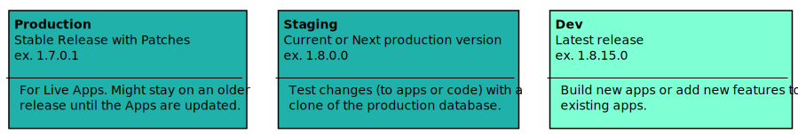
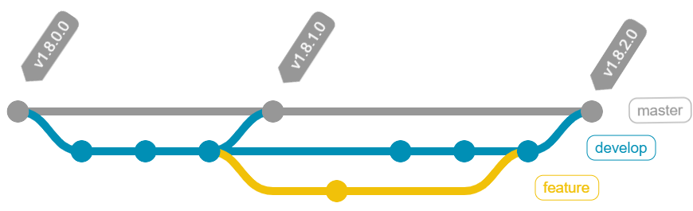
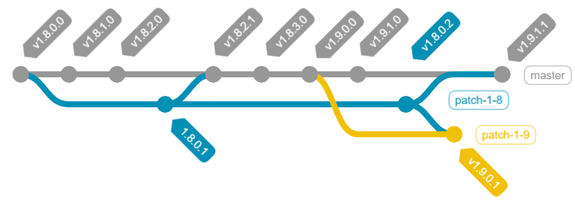

This is the release strategy for **[appdevdesigns/app_builder](github.com/appdevdesigns/app_builder)**.

Create [releases on GitHub](https://docs.github.com/en/free-pro-team@latest/github/administering-a-repository/managing-releases-in-a-repository) for each new version.

## Versioning
Versions should follow: **Major . Minor . Build . Patch**

- Increment Major for significant/breaking changes
- Increment Minor for changes used in a production environment
- Increment Build for Sprints and Small Changes
- Increment Patch for bug fixes

### Servers
In general servers should use a release from master. Suggested release for server type:\
_In this context the Dev, Staging, and Production refer to Apps within AppBuilder._
- **Dev** - use the latest release (build)
- **Staging** - use the planned version for production
- **Production** - use a Minor release

### Workflow
- At the start of a Sprint new feature branches from develop
   - Merge to #develop
   - Test
   - At the end of Sprint Merge #develop to #master  (increment build number)
   - Significant changes can be added to a release branch for testing and bug fixes

- Bug fixes branch from master
  - Merge to #master (increment patch) and #develop
- To patch bugs in old minor versions needed for live sites:
  - Create a branch from the release and make fixes
  - Create a new release on the patch branch
  - merge to #develop and #master

