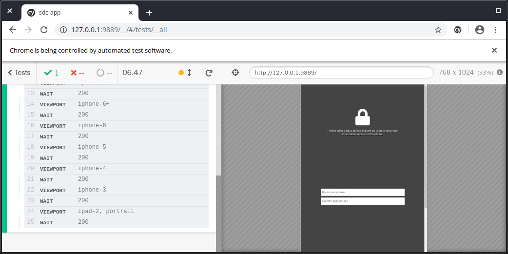
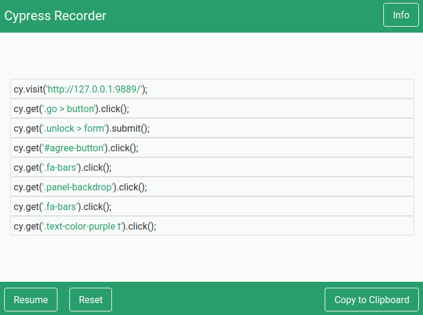

## Testing Philosophy & Goals

The key considerations for end-to-end testing are:

- Easy to set-up
- Easy to write tests
- Easy to run tests
- Integrates with Google Chrome
- Able to do in-browser “recording” to generate tests (for non-developers)
- Active and growing community
- Able to test mobile (web-based mobile apps)
- Extensive [documentation](https://docs.cypress.io/guides/overview/why-cypress.html)

[cypress.io](https://www.cypress.io/) meets these requirements, and is a lightweight framework chosen to do testing for our products.


Important concepts for testing are:

- Ensure that **test data is** **reliably consistent** across all environments (utilize fakes, stubs, and mocks)
- Aim for tests that are **not fragile** by not relying on CSS selectors, etc. (prefer “data-xyz” attributes instead)

## Installing Cypress

Installing **cypress.io** is very simple.

For manual installation, use **npm**. Installs cypress.io to your project directory (under `node_modules`)

```bash
cd {PROJECT_DIR}
npm i cypress
```

Alternatively, to add cypress as a development dependency into your project, use:

```bash
npm i cypress --save-dev
```

Cypress can be run using the following command:

```bash
{PROJECT_DIR}/node_modules/.bin/cypress open
```

**NOTES:**

- Bundles it’s own **node.js** instance (reduces version dependency issues)
- Bundles it’s own **web browser** (Electron / Chromium)

## Running Cypress Test Suites

cypress tests can be run either **interactively** or **headlessly**.

Running cypress tests in **interactive mode** (shows a UI)

```bash
cypress open
```

Running cypress non-interactively, or **headlessly** (can be used with continuous integration)

```bash
cypress run
```

**NOTES:**

- See [cypress.io Continuous Integration Guide](https://docs.cypress.io/guides/guides/continuous-integration.html#Travis) for use with Travis-CI



## Integrating into a project

Listing “cypress” as a dependency in a project’s `package.json` file allows npm to pull in cypress along with other project dependencies. This is done automatically when using `npm i cypress --save-dev`

```json
"devDependencies": {
    "cypress": "^4.0.2"
  }
```

Adding the following targets allows cypress to be run using `npm run`:

```json
  "scripts": {
    "build": "...",
    "watch": "...",
    "test": "cypress open",
    "test:ci": "cypress run"
  }
```

## “Recording” with cypress

Chrome Extensions are available, which enable “test script recording” in cypress’s output format.



Once a series of clicks has been recorded, the resulting output can be copied into a .js within the cypress directory structure.

Several different Chrome Extensions exist that have this functionality:

- [Fd Cypress Recorder](https://chrome.google.com/webstore/detail/fd-cypress-recorder/amleackadkomdccpbfginhnecfhhognj) - after some experimentation, this one is more fully featured and may offer the best experience for our needs (by James Duncan)
- [Cypress Scenario Recorder](https://chrome.google.com/webstore/detail/cypress-scenario-recorder/fmpgoobcionmfneadjapdabmjfkmfekb?hl=en)
- [Cypress Recorder](https://github.com/KabaLabs/Cypress-Recorder)

**NOTE:**

- The resultant code may require some assertion statements to be added in by hand
- [CSS Selector Helper](https://chrome.google.com/webstore/detail/css-selector-helper-for-c/gddgceinofapfodcekopkjjelkbjodin?hl=en) Chrome Extension may assist in the test creation process

## cypress File Layout

```
{PROJECT_DIR}
    /cypress
        /fixtures                 for mocks, fakes, and stubs
        /integration              tests specs
            - viewport.spec.js
            - login.spec.js
            - bugreport.spec.js
        /plugins                  auto-included plugins for extensibility
            - index.js
        /support                  auto-included in tests for convenience
            - commands.js
            - index.js

```

## Important Background Information

- Utilizes **mocha** and **chai** style statements for expects
  ```js
  // UI should reflect this user being logged in
  cy.get("h1").should("contain", "jane.lane");
  ```
- Most unique in that it runs in the same process as the client instance (unlike other testing frameworks, which run in a separate process)
- Bundles it’s own node.js instance, and chromium instance
- (For Windows) In Powershell: `Set-ExecutionPolicy RemoteSigned`
