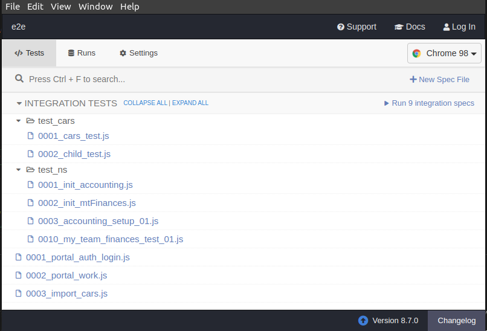
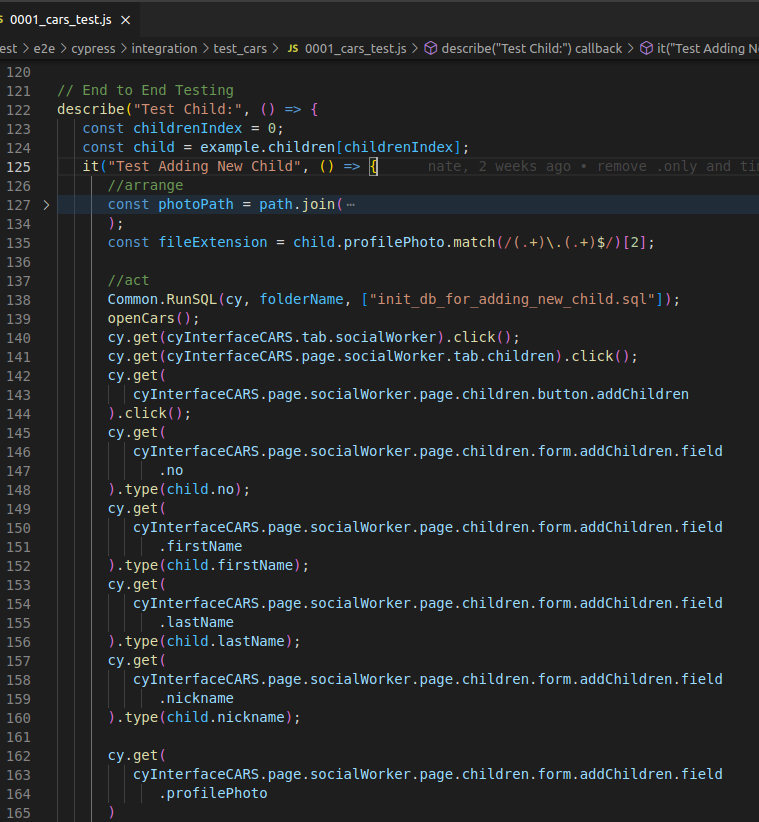
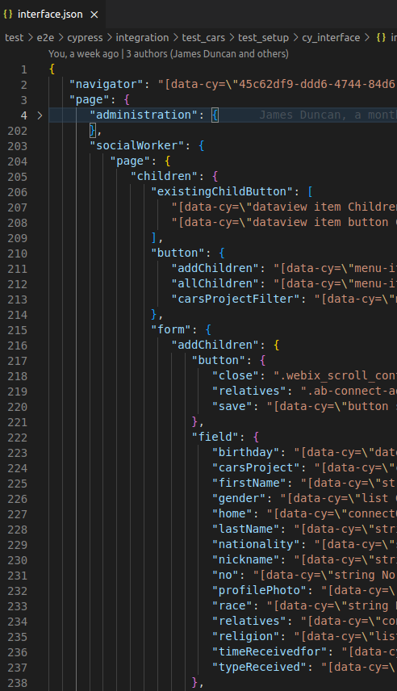
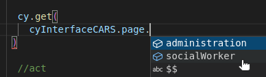

To set up our Cypress E2E test environment use the AppBuilder Installer to [setup a development environment](../../setup/Setup.md).
Note the additional steps for testing section.

## Scripts

Use `npm test` to start the docker test stack and run the tests in a headless browser. The docker stack will remain up so you rerun the tests using `npm test`.

Use `npm run cypress:open` to open the Cypress Test Runner. This allows you to run a test and watch it. This is recommended when writing or debugging a test. This requires the docker test stack to be running. Use `npm test` or `npm run test:boot` first.

Use `npm run test:down` to remove the docker test stack.

## Folder Structure

New tests can be added to `test\e2e\cypress\integration`. See [writing tests](../writeTests/WriteTests.md).

## Reference

### Test Ports

| Port | Container  |
| ---- | ---------- |
| 8088 | AppBuilder |
| 8889 | Database   |

## Intro to writing tests

These two commands are always running in the background while you write tests:

$`npm run test:boot`

$`npm run cypress:open`

Cypress open will give you this window where you can run any test in `/integration`:

There are two places you will spend your time working:

The logic: what buttons are clicked, typed in, and checked to see if data saved properly

The interface: this JSON is what is accessed by the 'cyInterfaceCARS' in the logic.

(VScode will prompt you with a variable on the logic side if it exists in the structure)

