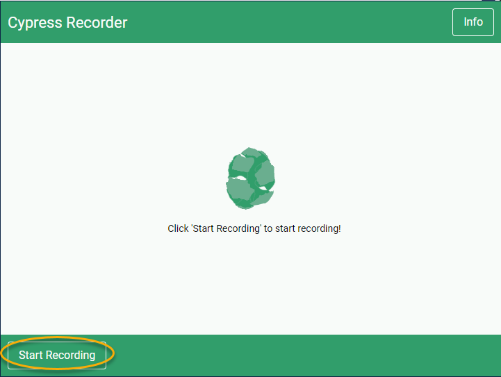
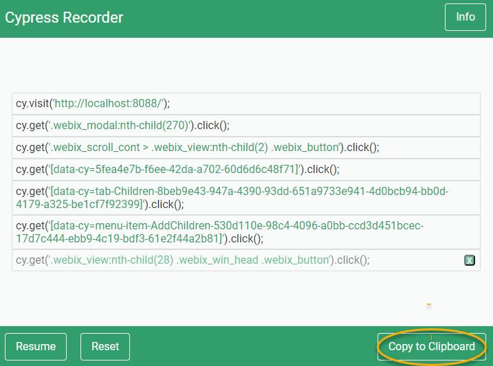

## Adding Tests

New tests can be added to `test\e2e\cypress\integration`.

Here is a basic template for our tests:

```js
const Common = require("../../../setup/common.js");

describe("Test Group Name", () => {
   before(() => {
      // make sure we have a clean slate before continuing.
      Common.ResetDB(cy);
   });

   beforeEach(() => {
      Common.AuthLogin(cy);
      }
   })

   it("Test 1", () = >{
      //Test
   })

   it("Test 2", () = >{
      //Test
   })
});
```

You will want to include `test\setup\common.js` as it contains some common code we want to run before each test:

- `ResetDB()` Will clear the Database of any Apps and Data.
- `AuthLogin()` Will add a Authorization cookie so that the tests don't need to login manually.

## Recording Tests

### Cypress Recorder

#### Install

1. Download (This is modified to prefer finding data-cy attributes)
1. Move to a place to store it
1. Unzip it
1. Open Chrome and go to chrome://extensions/
1. Toggle “Developer Mode” ON
1. Click on “Load unpacked”
1. Choose the unzipped package you just downloaded

#### Record

1. Click the cypress recorder icon
1. Click 'Start Recording'\
   
1. Perform the actions you want to test
1. Open the recorder and click 'Copy to Clipboard'\
   
1. Paste it into a test file
   ```js
   it("my test", () => {
     //Paste
   });
   ```

#### Notes

- It records `cy.visit()` with localhost. You will want to remove this so that the test can be run in other environments.

  ```js
  //recorded
  cy.visit("http://localhost:8088/");
  //change to
  cy.visit("/");
  ```

- It records extra clicks when filling out forms. These can be safely deleted.

  ```js
  //This first line is unnecessary
  cy.get("[data-cy=string-Nickname-e9a52908...]").click();
  cy.get("[data-cy=string-Nickname-e9a52908...]").type("Test");
  ```

- It is limited in what it can record. You will need to add [assertions](https://docs.cypress.io/guides/references/assertions#Common-Assertions) to make the tests actually perform a check
  ```js
  // Check that an expected element exists
  cy.get("[data-cy=string-Nickname-e9a52908...]").should("exist");
  ```

## General Tips

- Cypress recommends in its [best practices](https://docs.cypress.io/guides/references/best-practices#Organizing-Tests-Logging-In-Controlling-State). That each test (`it`), should be able to run independent of any other tests. Adding to `beforeEach` can make this easier.
