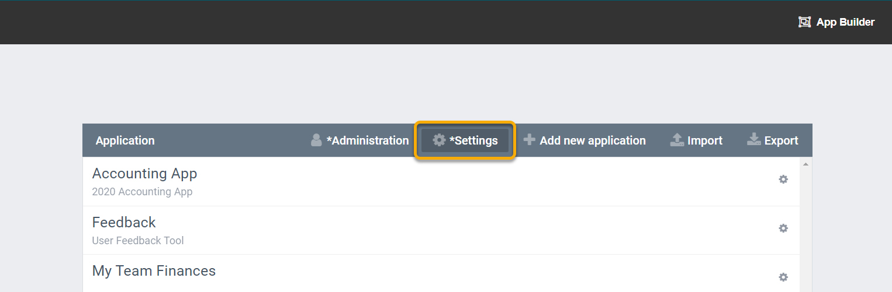
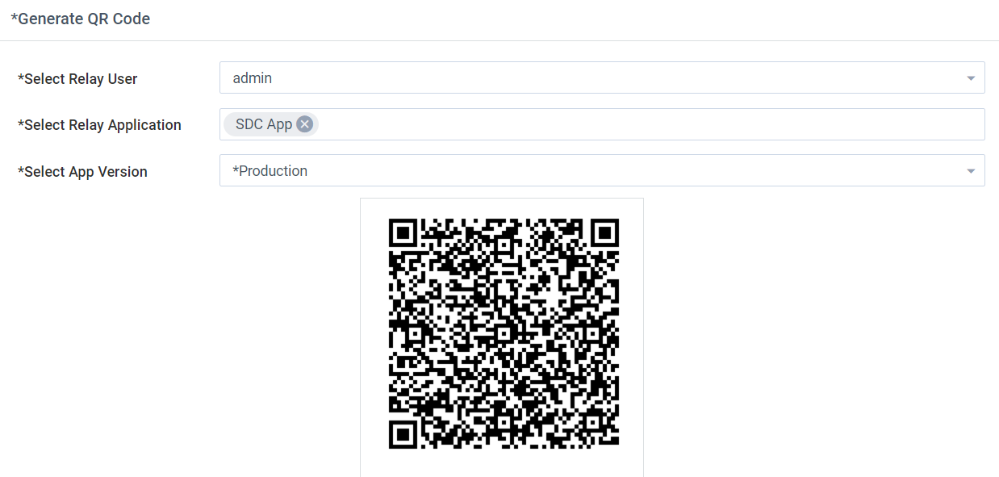

QR codes can be generating from AppBuilder to link user's mobile app to the correct user.

## Generate QR Codes

1. From AppBuilder click “Settings”
   
1. Under “Generate QR Code” choose your user for “Select Relay User”
1. Select “SDC App” for “Select Relay Application” then choose “Production” for the “Select App Version”
1. The QR code will appear below and you can scan it.
   
