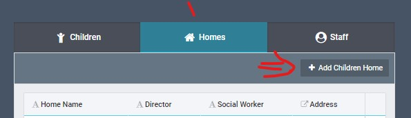
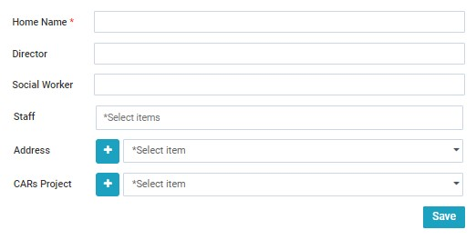
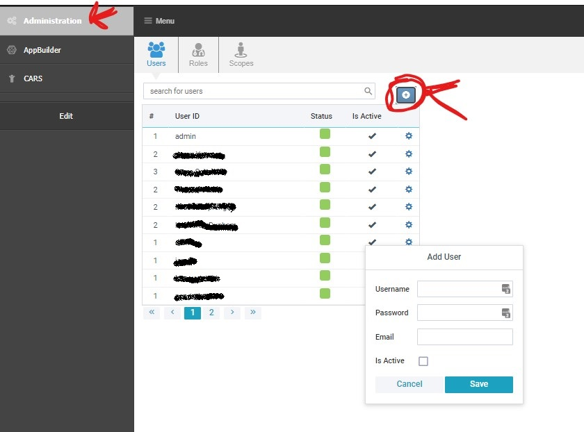
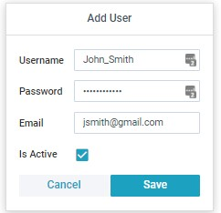
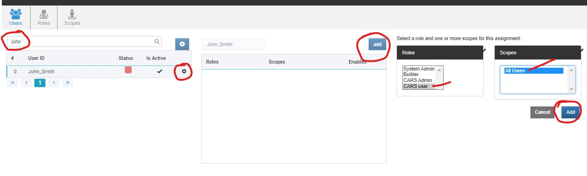
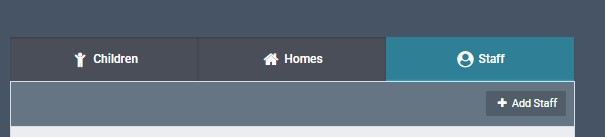
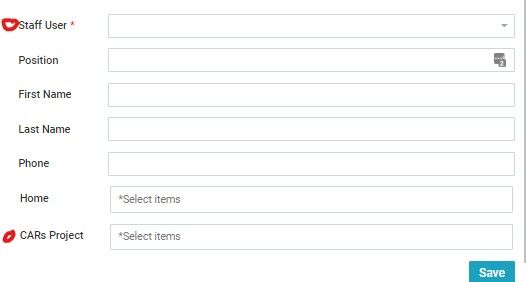

How to get a blank CARs version ready for users. 
Adding Projects -> Homes -> Staff -> Login-creds for users

What the system expects when adding a child,
then what reports you can expect to generate.

## Adding Projects 

Because of the way we set up our system, even single-home setups will need to have this

`<TODO update this when project process is adjusted>`

 Go into the appbuilder page, CARs, Objects, CARs Projects

 Click "add new row" and then put in the name of your project

## Adding Home

Once you have the project, add a 'home'

This can be done on the front end from the top tab.

On this form, make sure to select the project you just made.

## Add Homes  Staff 

Set up user

-Add with username and password

-Add CARs role

-add to scopes

-Add staff record

-Add to project

### Create user, permissions

The first stet to allowing staff to access the system is adding login credentials. 

The form should look like this before you're ready to save. 

I recommend telling the user to set their own password once their user is made. 

While you're on this screen, type in the user's name (if they aren't on the first page)

Then open their settings, and give them the "CARs user" scope. This will allow them to 

(only!) open the cars page on the sidebar. 

If you have multiple staff to add, you should repeat this step until they all have logins and system access permissions.

### Scopes and Staff record
now just because they can open the CARs page, doesn't mean they're allowed to see any children.

Follow the "assign a role" directions on this page to set up your users. We should have set up "project worker" and "social worker" roles for your install already :)

https://CruGlobal.github.io/appbuilder_docs/user/permissions/roles/Roles.html#assign-a-role-1

### add Staff record
go to this page on the CARs frontend

Select the user and project you recently added, 

fill in any other information, and your new staff will be ready to log in and start adding data!

