the system expect records to be connected in order to build DOCx reports.

This is how you can check if those records are made

This is a fully filled out report document, you can compare to your result to know what you're missing. Has breadcrumb trail to input area on website

## What records are needed

|  Root  |                            |                           |                           |                |                     |
|--------|----------------------------|---------------------------|---------------------------|----------------|---------------------|
| Child  | Admission information      | Prelim Health Exam        | (ongoing) Child documents | (initial) Fact | (ongoing) Life Plan |
|        | (initial) Asset Log        | (intake) Growth Log       |                           |                |                     |
|        | (intake) Basic Health Info | (intake) Physical details |                           |                |                     |
|        | (intake) vaccination       |                           |                           |                |                     |

These allow us to download this report

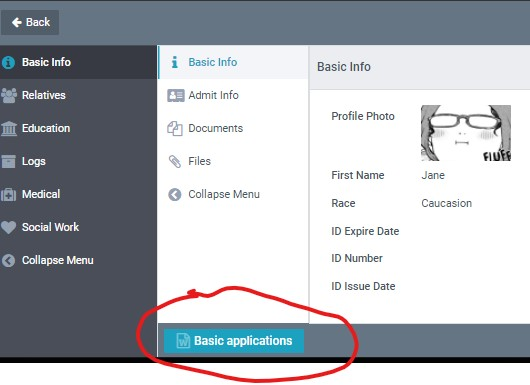

Now! it is possible to download this report simply with the 

[+] Add Children

button on the children page.

But blank fields will be shown on this report. 
Here is the template, hopefully this will help if your output seems to be missing anything
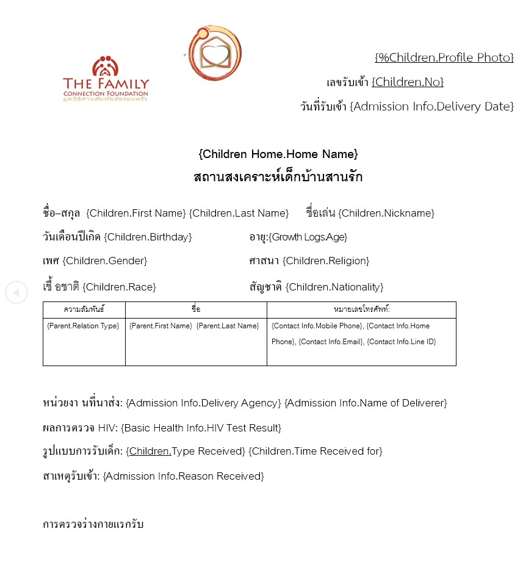
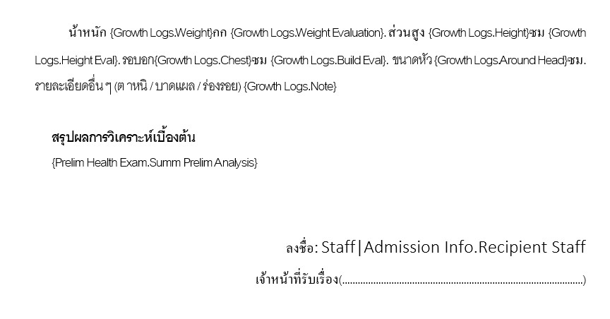
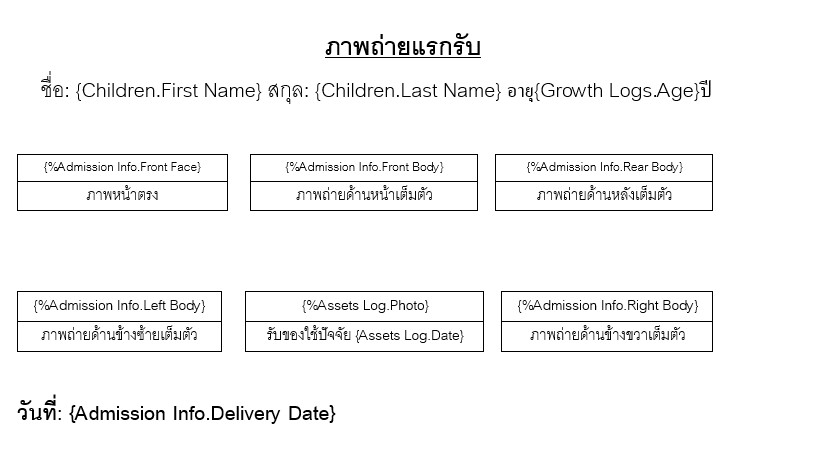
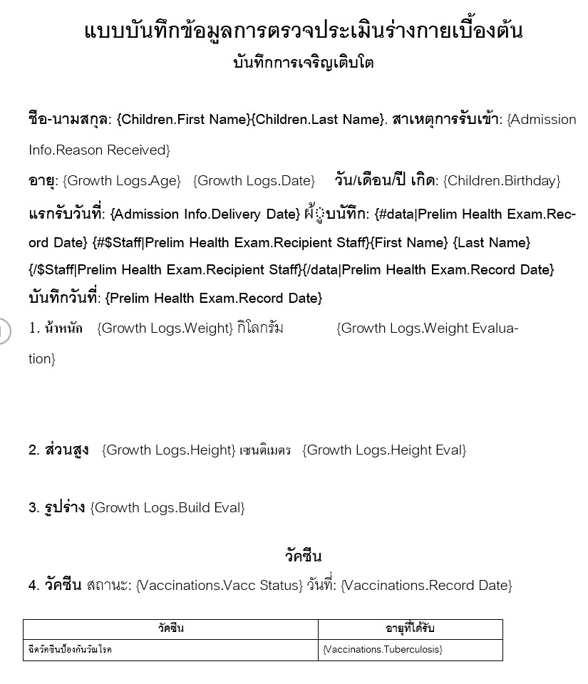
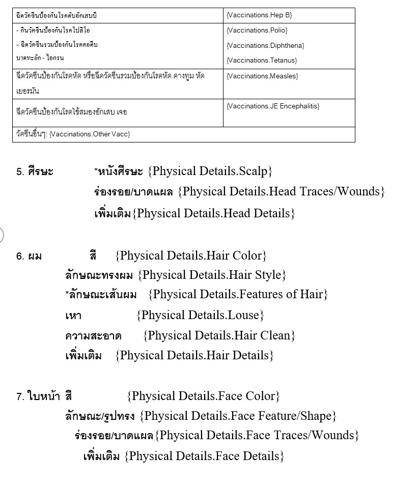
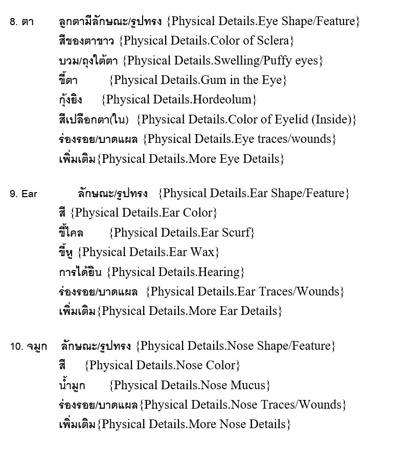
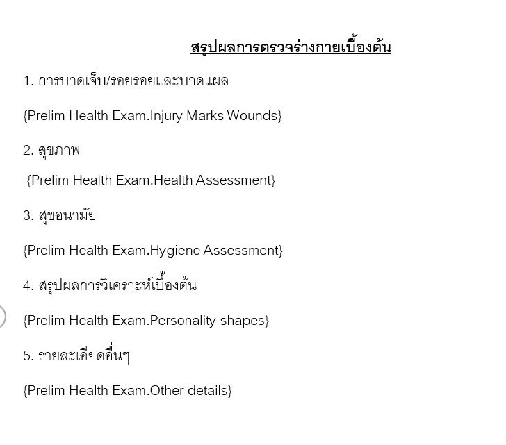
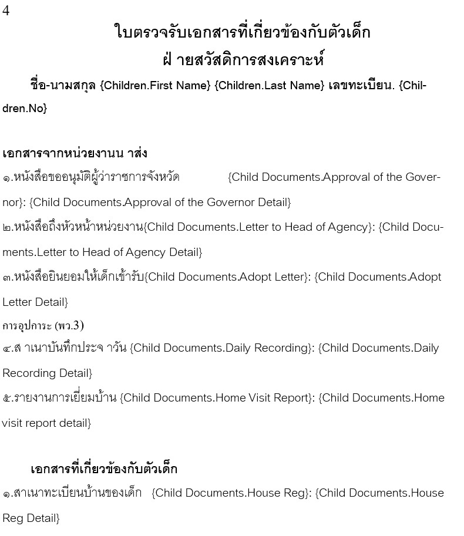
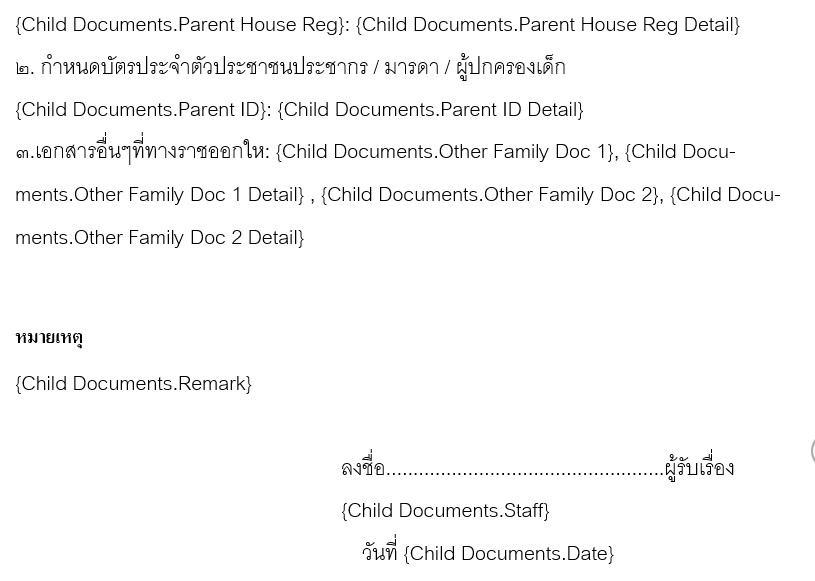
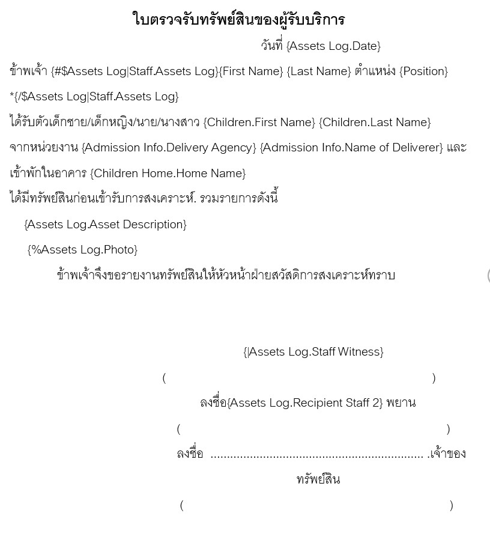