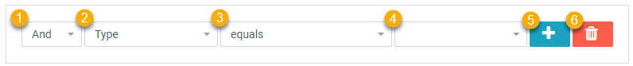

Filters can be used in many places within AppBuider to narrow down a set of records. A filter rule looks like this:

1. **And/Or:** 'And' or 'Or' is used when you have multiple filter rules, to determine how to apply the rules. If all the rules should be true then select AND if only one of the rules needs to be true then select OR
1. **Field:** This is the Object Field to use in the filter.
1. **Operation:** This is the type of operation to be used for filtering. A default choice will be made based on the field type. See Operations Below
1. **Value:** The value used depends on the Operation, sometimes it is text, number, date or a selection. In certain cases no value is needed
1. **Add Another Rule**
1. **Delete the Rule**

## Operations

The types of operations available depend on the field type of the field being used in the query.

- **By Query Field**
- **Not By Query Field**
- **In Query** Shows records whose a connected record in this field is a part of the given Query
- **Not In Query** Shows records whose a connected record in this field is not in the given Query
- **In Data Collection** Shows records whose a connected record in this field is a part of the given Data Collection
- **Not In Data Collection** Shows records whose a connected record in this field is a part of the given Data Collection

* **contains** Shows records that have part of the given text in this field.
* **doesn't contain** Shows records that do not have the given text as part of this field
* **is** Shows records whose value in this field is exactly the same as the given value
* **is not** Shows records whose value in this field is not exactly the same as the given value
* **Same As User** Shows only records whose value in this field matches the value of the currently logged in user
* **Not Same As User** Shows only records whose value in this field is not the value of the currently logged in user
* **equals** Shows records whose value in this field equals the given value
* **does not equal** Shows records whose value in this field does not equals the given value
* **is current user** Shows records that only contain the current user in this multi-user field
* **is not current user** Shows records that in this multi user field do not only have the current user.
* **contains** current user Shows records that have the current user in this multi user field
* **does not contain** current user Shows records that do not have the current user in this multi user field

- **=** Shows records whose number in this field equals the given number
- **≠** Shows records whose number in this field is not equal to the given number
- **<** Shows records whose number in this field is less than the given number
- **>** Shows records whose number in this field is more than the given number
- **≤** Shows records whose number in this field is less than or equal to the given number
- **≥** Shows records whose number in this field is more than or equal to the given number

* **is** before Shows records whose date in this field is before a given date.
* **is after** Shows records whose date in this field is after a given date.
* **is on or before** Shows records whose date in this field is the same as a given date or before.
* **is on or after** Shows records whose date in this field is the same as a given date or after.
* **is before** current date Shows records whose date in this field is earlier than the date today
* **is after current date** Shows records whose date in this field is later than the date today
* **is on or before current date** Shows records whose date in this field is today or earlier
* **is on or after current date** Shows records whose date in this field is today or later
