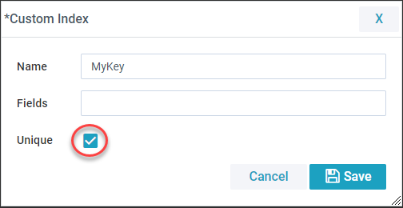
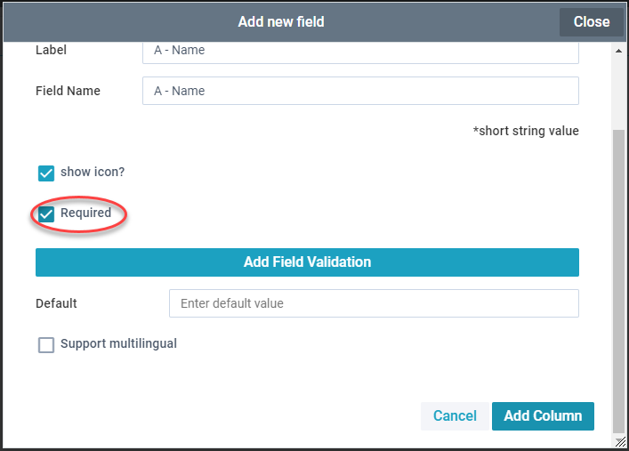
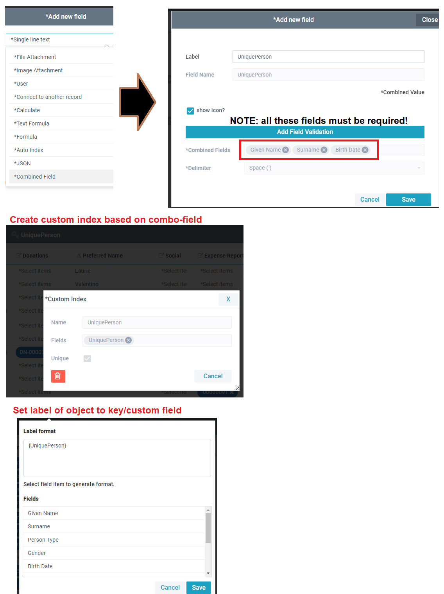
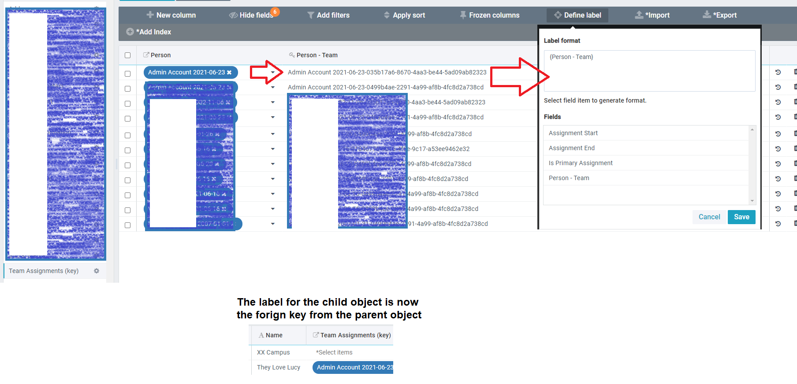

## Instructions

To connect an object using a Custom Foreign Key first you need to create a valid index. Click add Index then fill out the details, including the name of the index, the field(s) to use to create the index and whether it is a unique value or not.

Only unique indexes are valid for use in a connected record field. Also the field used in the index needs to be a required field (set this in it's field properties).

After creating a valid index the option 'use custom foreign key' is available when adding a connected record field.

## Which Object's Key is Used

| Connection Type | Uses A's Custom Index | Use's B's Custom Index |
|-----------------|-----------------------|------------------------|
| Many A - Many B | x                     | x                      |
| Many A - One B  |                       | x                      |
| One A - Many B  | x                     |                        |
| One A - One B   |                       | x                      |

## Setting up a 'pretty' index
The plan is to use this key later on as a label. So we want it to be as user friendly as possible. So we'll use a "Combined Field" to make what should be a unique combination of fields. Firstname+Lastname+birthday.
Once this is created, we can also use it as the label of this object for consistency. 
Remember that this has to exist before creating the connected fields! Try to have a plan for what forign keys you'll need in your app before building too much of it. 

## Using key as a label in a child object
Say a child object has no identity apart from a parent object. We can use the same 'Combined Fields' to use that connected field as a label.
Note in this example, that a non-forign key connected field was used in the Combined field, and it shows the uuid rather than the label.

