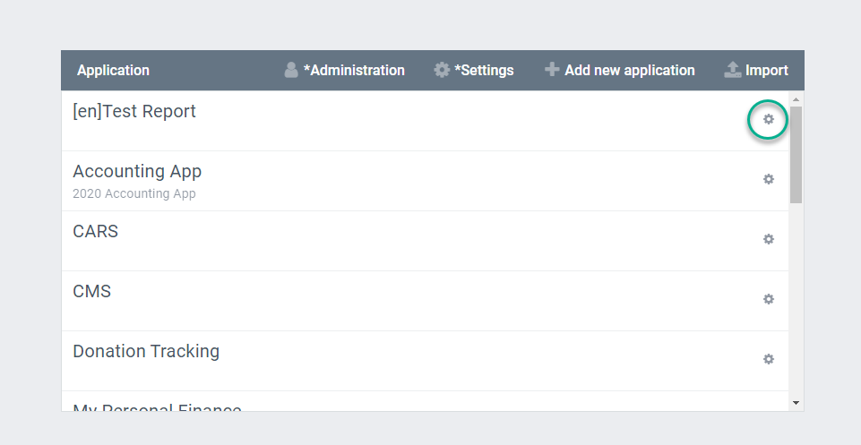
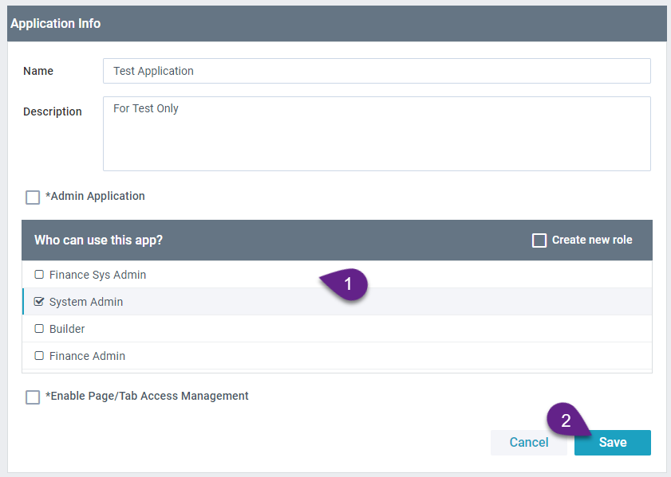
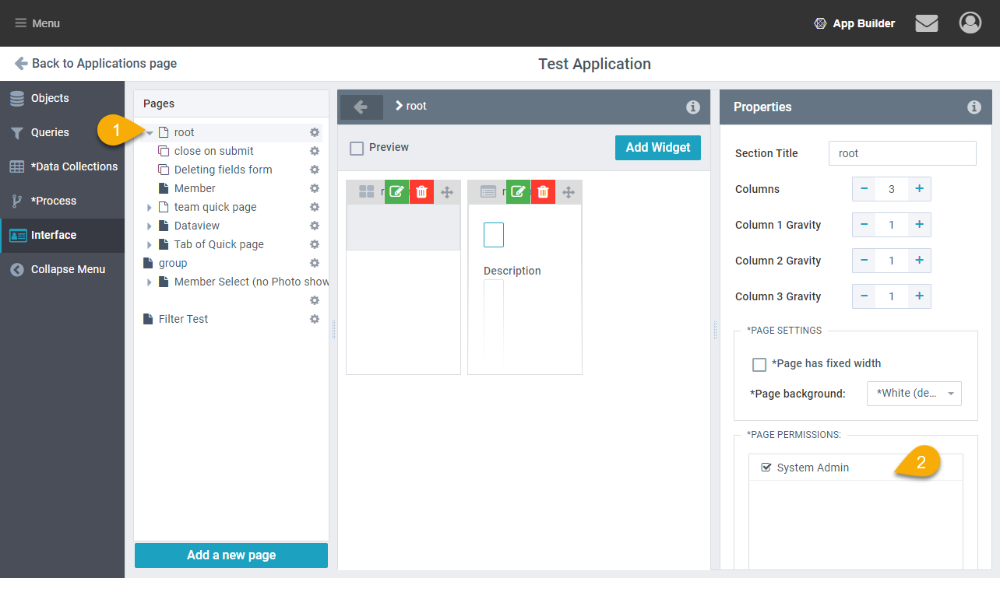
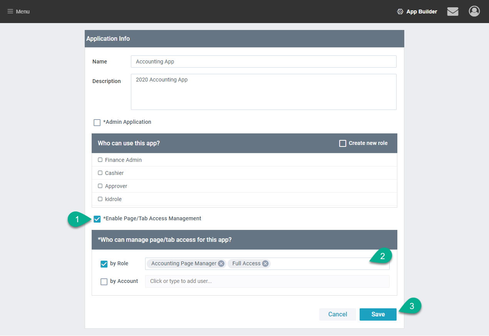
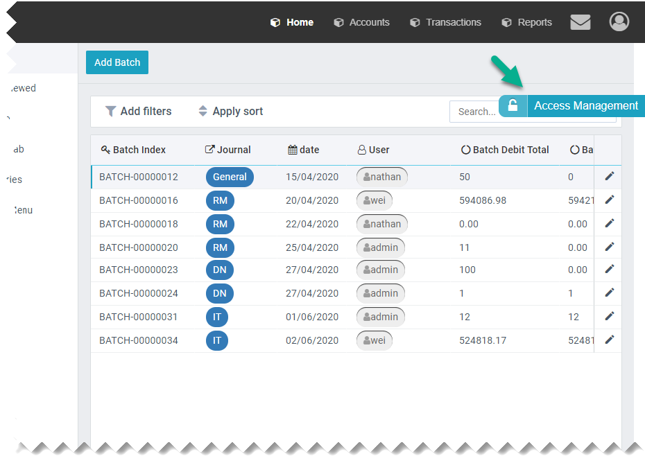
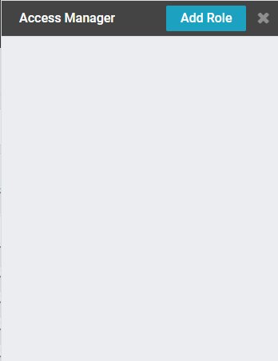
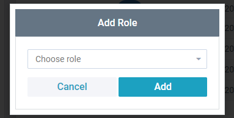
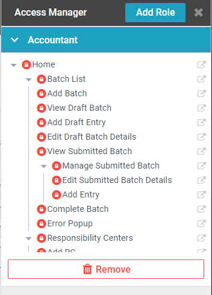
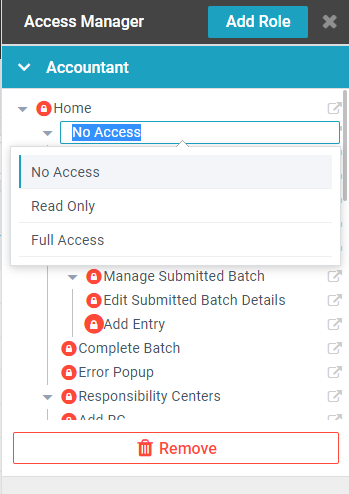

Page access can be handled in two ways in AppBuilder. By default a module is visible to any [site role](../roles/Roles.md#site-roles) that has been given access. If more fine grained control is needed the
[Access Management Page (AMP)](#access-management-page) can be used to assign access to specific sub pages and tabs based on [AppBuilder roles](../roles/Roles.md#appbuilder-roles).

## Grant Access to an Entire App/Root Page

1. From AppBuilder select the cog beside the module and choose setting

2. Under ‘Who can use the app?’ find a check the role
3. Click **Save**

4. That role can now see all root pages in the module. From the user interface builder you can open a root page and change the Page Permissions in the Properties panel.

## Access Management Page

### Turn on Access Management

In AppBuilder Click on the cog beside an App and select ‘Edit’

1. Select **Enable Page/Tab Access Management**

2. Select **by Role** and add the Builder Role (‘Full Access’ on Trial). If any other role or account should be able to manage page access add them too.
3. Save

### Managing Page Access

1. In the live view of the module select the lock icon (top right) to open the Access Management Tab

2. In the tab select **Add Role**

3. then in the pop-up choose the role and click **Add**

4. You should now see a list of Pages and Tabs. To preview a page click the
    icon.

5. To Change Access Click on the Circle next to the page name and select the appropriate access level.

