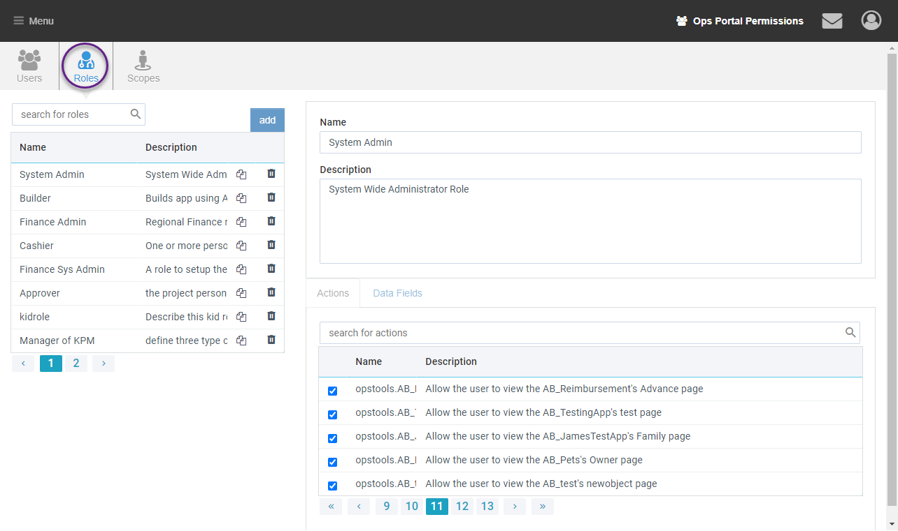
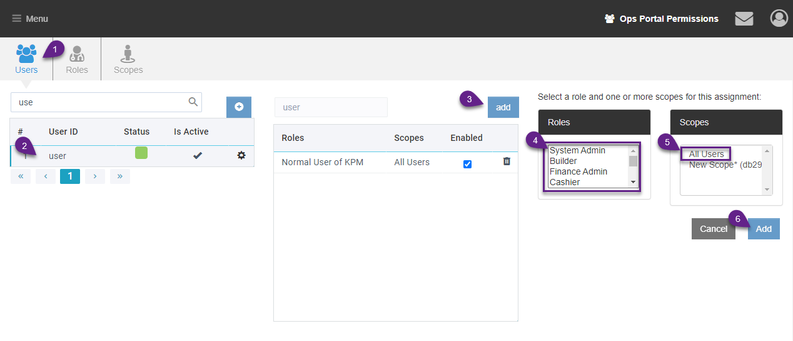
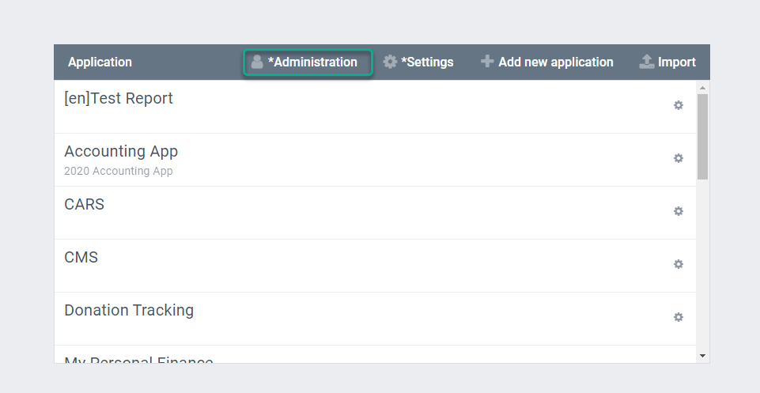
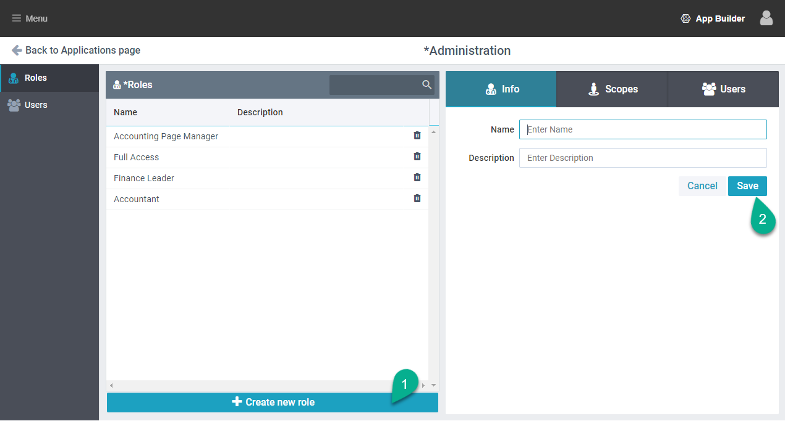
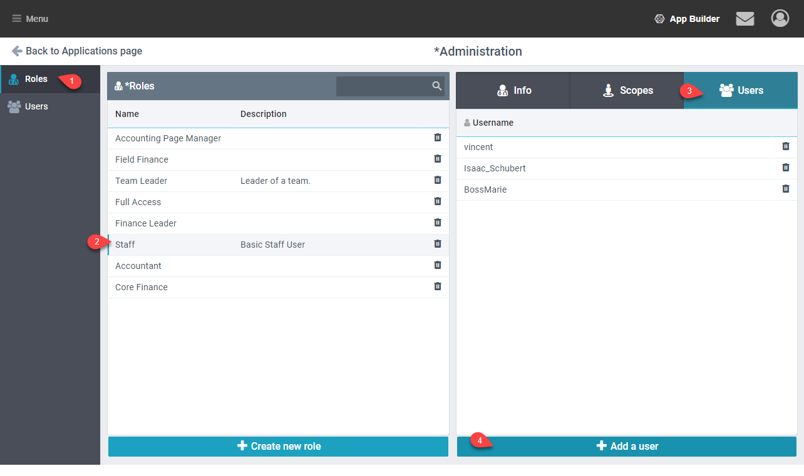

Currently 2 types of roles are used, site roles (opsportal) and AppBuilder roles. In most cases users will need at least one of each role type.

## Site Roles

Site roles are managed from the Administration module.

These roles are used to assign permissions for AppBuilder, Ops Portal, and Access to the Root Pages of a module.

### Add a Role

1. Access site roles by going to Menu > Administration then the Roles Tab
1. Click the **add** button
1. Give the role a name, description and check any permissions it should have.

### Assign a Role

1. Go to the Users tab
1. Find the user and click on them
1. Click **add** to assign a new role
1. Select the Role
1. Select the Scope (in most cases ‘All Users’)
1. Click **Add**

## AppBuilder Roles

AppBuilder roles can be used with the Access Page Manager to set fine grained access permissions down to any page or tab. They can also be assigned Scopes which limit the data the user can see.

User with an AppBuilder Role will still need a Site Role that gives them access to the module.

### Add Roles

1. In AppBuilder go to the Administration Page

2. In the ‘Roles’ tab click ‘Create new role’
1. Add a Name and then ‘Save’

### Assign a Role

1. Open the AppBuilder Administration, Roles page
1. Select the Role
1. Click the Users tab on the right side
1. Click Add a user
1. Select the user from the popup and click save

