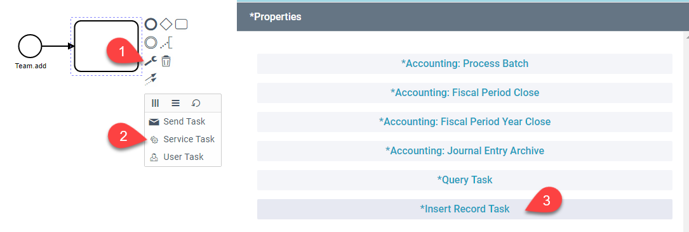
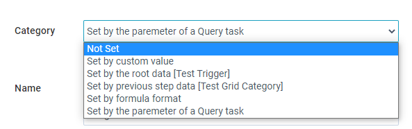
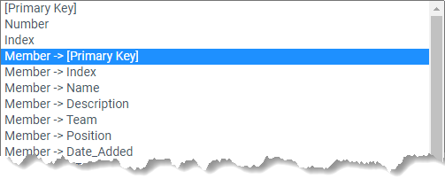
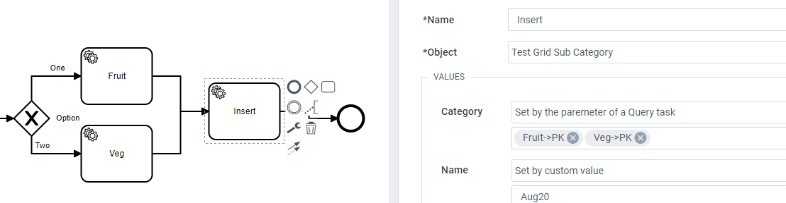

This is a task that can be added to a process to insert a record using relevant data from the process.

## Add the task

## Configure Properties

Name the task - The name is used in the process diagram and in the monitoring logs.
Object - Select the Object you wish to insert.

### Setting Values

For each field in the Object you will see a dropdown with options for setting the field value. By default it will be 'not set'. Use this if you want to keep the value blank.

#### Set by Custom Value

Use this if you want to directly set the value. This supports using a custom index value in a connected record field.

#### Set by the root data

This sets the value based on the record that triggered the project. From here you will see a dropdown number of options. All options are available, but you will need to consider the field types.

- **[primary key]** use this to set a connected record field (_1:M only_) as connected to the root Object. This will only work if the field you are setting is connected to the object you are connecting.
- **field** the first options show any field in the root object. Pick what value you want. If the field you are setting is a string, numbers and indexes can be used but will be converted to a string
- **object ->** This notation is used to access values from connected records attached to the root object.

#### Set by previous step data

This is similar to using the root data, but instead looks to values in a previous step. This allows you to chain and create multiple related records. The dropdown shows the same options.

#### Set by formula format

This allows a formula to be used to set the value. Both number and text formulas are supported. This requires a specific syntax:

- `[startData.FIELDNAME]` - this is to access the record that triggered the process
- `[previousData.FIELDNAME]` - this is used to access the record in the previous step
- `[QUERY_TASK_NAME.PARAMETER_NAME]` - this access a parameter saved from a previous query task. QUERY_TASK_NAME represents the name entered in the query task's properties and PARAMETER_NAME is what was used to save the plucked data within the query.
- `__relation.` can be used after a connected record field to access fields of the connected record
- For Strings use a `new String()` constructor with a [template string](https://developers.google.com/web/updates/2015/01/ES6-Template-Strings)

**Examples**

- `[previousData.Number] + 50`
- `` new String(`Team: ${[startData.Team__relation.Name]}`) ``

#### Set by the parameter of a Query Task.

This allows you to use data saved from a Query Task. You will see a list of available parameters. Multiple values can be selected, but the first one with a value will be used. This is intended for when a process has multiple paths it could follow to get to the insert task.

## Multiple Instances

This task can be repeated multiple times using the bpmn multiple instance marker ().

Add the marker from the wrench () menu on the task. After adding the marker a **repeat** option is available in the task properties. A connected record field (from the process object) can be selected. This will cause the task to repeat for each connected record attached to the process object. The connected record values are available to set the inserted values, using the 'Instance Data'.
