## BPMN Basics

The Process Manager uses bpmn notation format. The main elements are represented using these shapes:

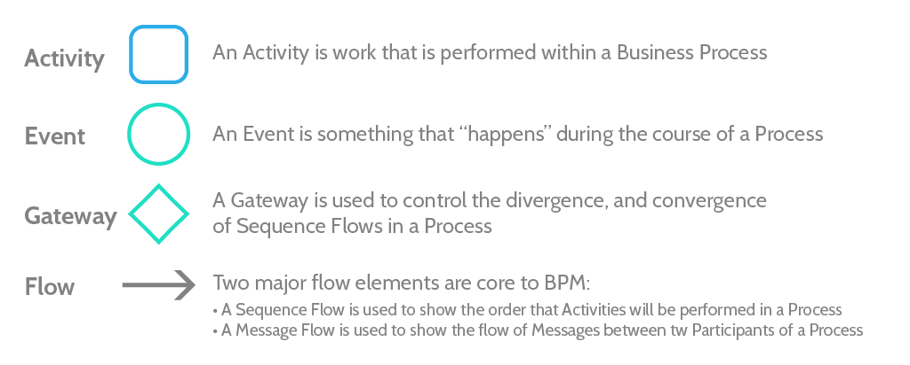

### More on BPMN

[bpmn tutorial](https://www.process.st/bpmn-tutorial/)\
[bpmn 2.0 spec](https://www.omg.org/spec/BPMN/2.0/PDF)

## Add a New Process

In AppBuilder in the _Process_ Tab click _Add new Process_ and give it a name.

### Set up the Trigger

To start click the Start Event (Circle) then the Wrench and select the process start trigger, in most cases this should be an Object Lifecycle Trigger

#### Object Lifecycle Trigger

In the Properties Panel add a name that describes the trigger (this will show up as a label under the start event)
Select the object and the action that starts the process.
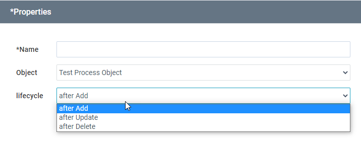

## Append Steps

Click on any symbol in your process and use the quick menu to append a task, event or gateway.

## Gateways

Gateways are used to split the process based on a condition. Before configuring a gateway you should add at least two paths from your gateway. Then you can go back and add a condition for each path.
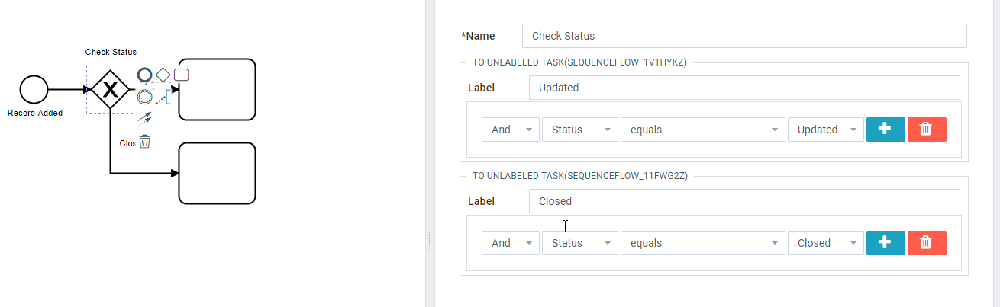

## Tasks

Three main classes of tasks can be added to a process. Depending on the choice different task types can be added.

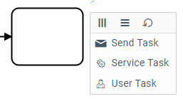

### Send Task

Used to Send an Email

To work on message field using process variables (Query Task Save and Get Reset Password Url).
   - Query Task Save: ``
   - Get Reset Password Url Task: ``

   Example:
      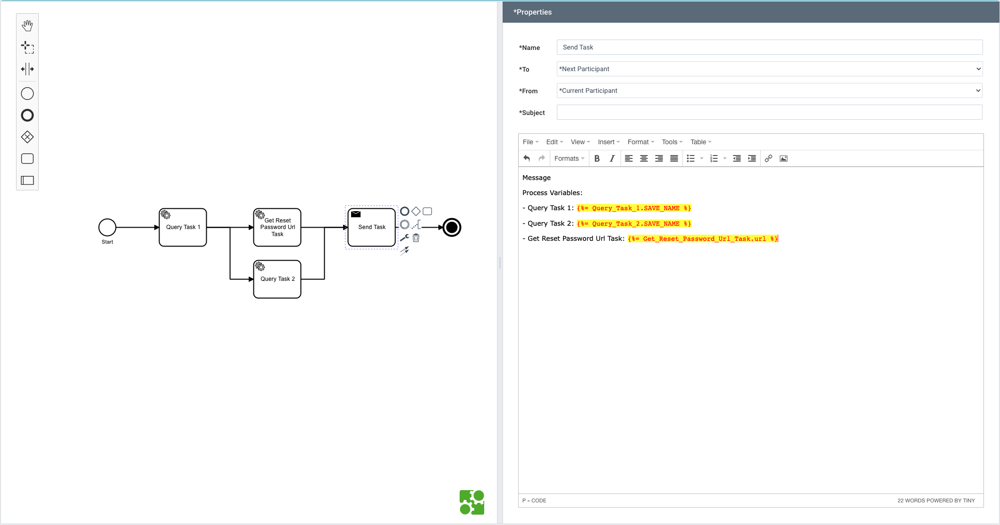

### Service Task

#### Query Task

Used to make changes to an object.

##### Modifying the Process Object

In most cases you will be making changes to the process object (the one that triggered the process).
Add a name to describe the task then build the query as follows:

1. Select ‘object’, the Object your process is based on, and then ‘find’
   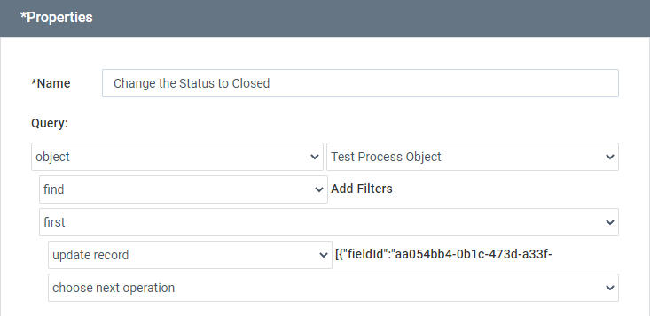
1. Add a filter and match the record that equals the process value at the process trigger (context)
   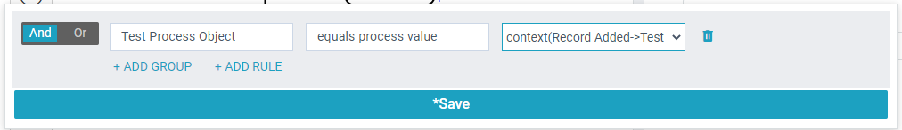
1. Select ‘first’, then ‘update record’
1. Click beside ‘update record’ and add the fields you want to edit
   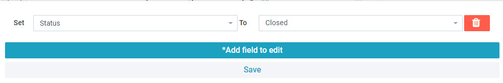

### User Tasks

#### Approval Task

Add a Name to describe the approval task.
Then add ‘Who’ to determine who the approval task is sent to. This can be by setting a user or selecting a role.

##### Customize the Form

You can drag and drop from the available fields and add buttons.
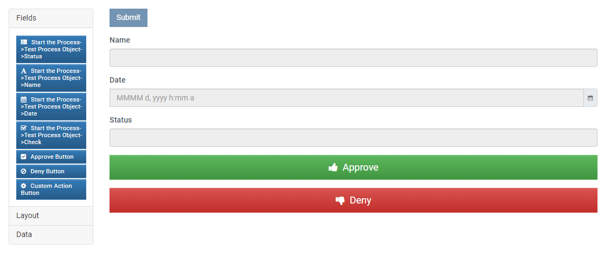

##### Dealing with the approval result

Add a gateway after the approval task and the task options that would happen based on the approval result.

In the gateway set the filter My Approval Task-> Response equals
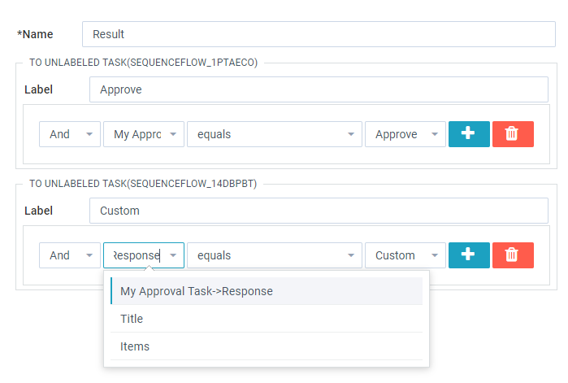

Responses use the of the Button Component ‘Label’
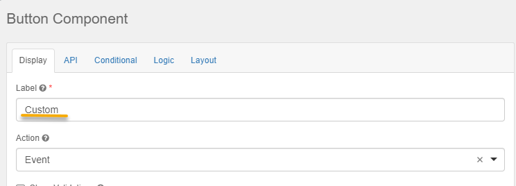

### Events

#### End Event

Add an end event when the process should finish.
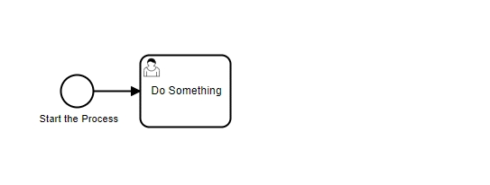
