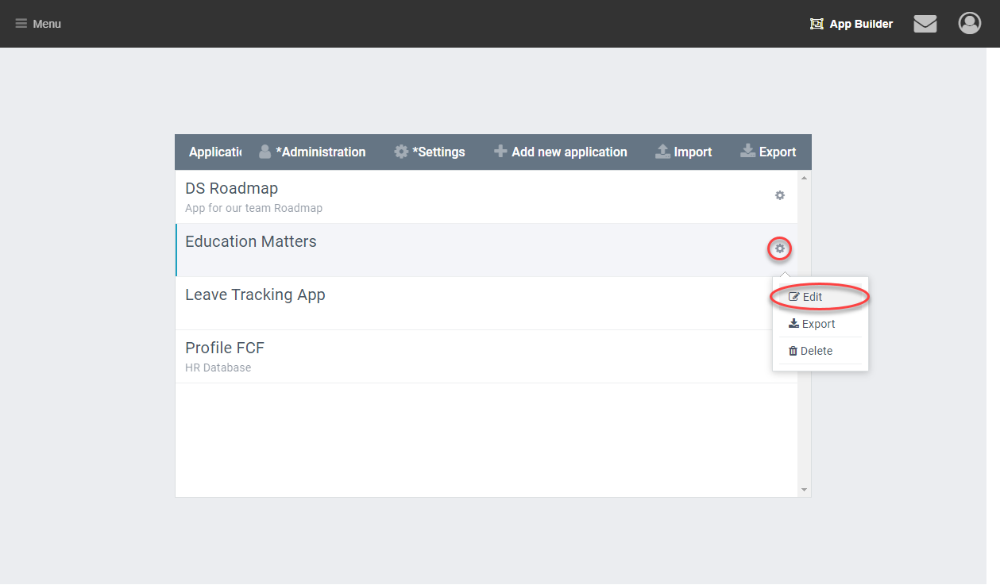
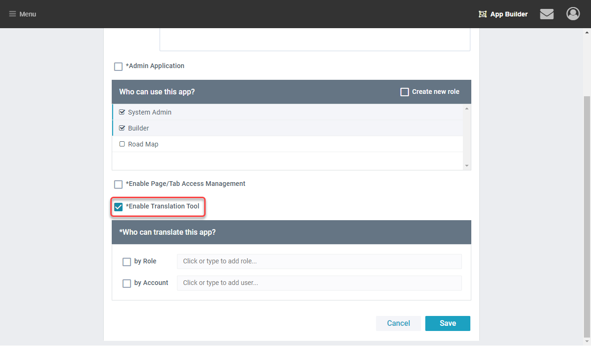

This article explains how to turn on the translation tool and use it to translate an app.

## Enabling Translations

1. To enable translations open your app settings from AppBuilder.\
   

1. Find and select the Checkbox 'Enable Translation'\
   

1. Lastly choose the users or roles that should see the translation tool.

## Translating

1. Within an app that you have translation permissions for, you can see the translation tool icon in the upper right corner. Click on it, a dialog window will show up. There are 3 sections: a Translation Tool menu bar, Data Objects and Interface Items.\
   \
   

2. Click on the gear icon, you can see two drop down boxes. Click on the one behind “Translate to” to choose the desired language you want to translate for.\
   
   

3. Click on “Data Objects” to unfold the objects if they are folded. Data object translate the field that store data. These fields are used in tables, forms and other places.\
   

4. Click on the item that needs to be translated. Fill in the text box with the translation. You can hover over an item to see how it is translated in the selected Hint language.\
   

5. You can do the same for the Interface Items. These phrase are used mostly as titles and button labels.\
   

6. Clicking the arrow icon beside the item will bring you to the page that it is used on. This allows you to see the context.


