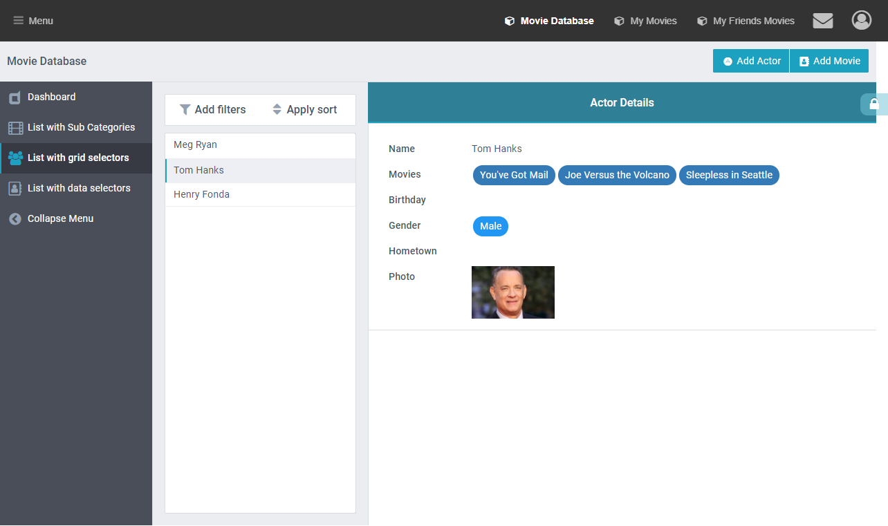

A grid can be used a selector, where selecting a specific item from the grid that displays in other widgets on the page.

We use this in our **Style Guide > List with grid selectors** to show a list of actors. Clicking an actor displays there details on the right.

## Instructions

1. In the Data Collection select a cursor fix, default first record.

2. Add a Detail Widget to the page and set the data collection.\
   _Note: In order for the grid to update the page, the detail widget is needed. If you don’t need to display the details you can remove all fields and set the height to 1._
3. Add a Grid:

   1. Set the Data Collection

   2. Set the Current Page as the Detail Page (you need to add the detail widget first)
   3. Go to Hidden Fields Settings and **Hide All**
   4. Check **Hide table header**
   5. Check **Show a field using label template**
   6. Check **Hide edit and view buttons**
