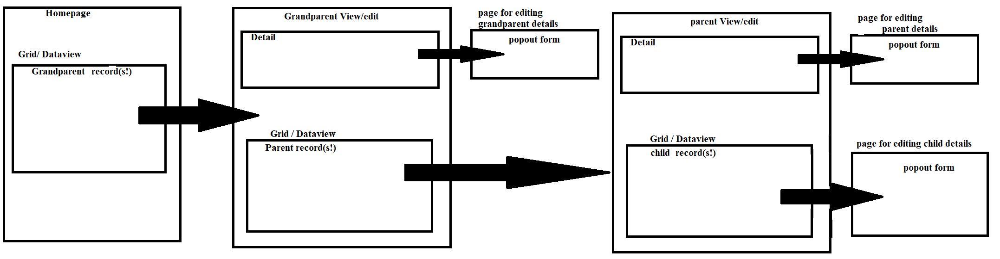

Pages are the main building block of the user interface. Keeping a logical page structure makes additions and changes to the UI simple. Pages contain widgets, learn about [widgets](../widgets/Widgets.md).

## Adding Pages

To add a new page from **Interface** select **Add a new page**. By default you will be prompted to add a blank page. You can also add a [quick page](quickPage/QuickPage.md).

Select the parent page and name your new page. The new page will be added below the parent page. Selecting [Root Page] as the parent makes the new page a root page.

### Page Types

There are 3 main page types that behave differently.

**Root Pages** - These will show in the top navigation bar.

**Standard** - Any page below a root page will be a standard page by default. These will not be accessible to users unless it is linked from a menu or other widget.

**Pop up** - Standard pages can be changed to a pop up. These are displayed as a small window above the current page.

#### Linked Pages

These pages can be any of the 3 types above. Adding the corresponding widget to the page allows them to be linked from certain widgets, such as a grid.

**Detail Page** - This requires a [detail widget](../widgets/detail/Detail.md) with a data collection matching the data collection in the widget linked from.

**Edit Form** - This requires a [form widget](../widgets/form/Form.md) with a data collection matching the data collection in the widget linked from.

## Properties

**Section Title** - change the page name.

**Columns** - Add columns as needed to display multiple widgets in line horizontally.

**Column Gravity** - Adjust the size of a column relative to other columns.

**Type** - Change from a page to a popup. _Not an option on root pages_.

### Page Settings

**Page has fixed width** - select to set a specific page width.

**Page width** - Set the page width.

**Page background** - Change the background color. Either White or Dark Blue

### Popup Settings

_Instead of Page Settings for Popups._

**Width** - adjust the popup width.

**Height** - adjust the popup height.

### Page Permissions

_Only a property on root pages._

A list of site roles that have permission to view the module. Unselect to prevent the role from seeing this root page and any pages under it.

### Example page structure

This is my system for allowing a user to access and edit 3 tiers of objects. For view only, we remove grandparent and parent's popout forms, and replace the child's form with a detail view.

This is being used for Expense reports. A user can have many Expense Reports(trip to conference, office supplies), each of whitch can have many children(lunch, room), each of which can then have multipile children(recipt 1, receipt 2).
This structure means a user has to open "Trip to Conference" before editing the "Room."

