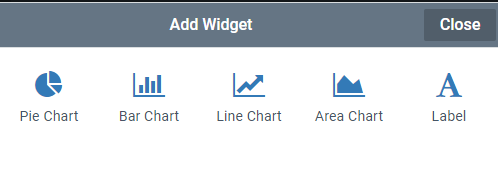
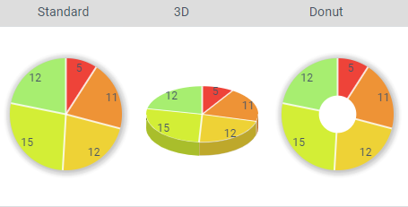
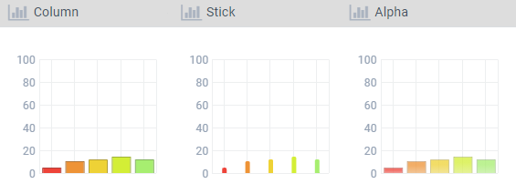
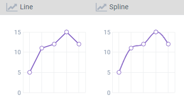
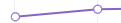
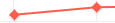
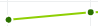
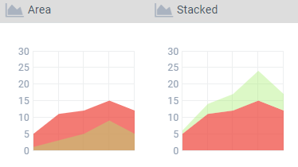

The Chart widget allows data to displayed in a graph.

The Chart widget itself is a container that has properties to load data. An additional widget must be added to it to display the data in the desired chart type. Multiple Charts can be added to one Chart widget, but they will share the same data.

## Properties

**Columns** - You can increase the columns to allow multiple chart widgets to be displayed in line horizontally.

**Column Gravity** - Use column gravity to adjust the size of a column relative to the other columns.

**Multiple Series** - Select this if you wish to display multiple values on the same graph. _Note: Only the Area Chart supports multiple series._

**Chart Data** - Select the data collection that holds the values for your chart.

**Label Column** - Select the field from your data collection to use as the label in the Chart.

**Value Column** - Select the value field.

**Value Column 2** - If using Multiple Series select the secondary value.

**Percentage** - Select percentage if you wish to show a percent rather than the value. This is relative to the total of the entire series.

**Display Label** - Unselect to hide the labels from the Chart.

**Label Position** - ?

**Height** - Adjust the vertical space the chart container uses

## Chart Type Properties

Each Chart Type Widget has it's own Properties that affect how it is displayed.

### Common Properties

Most chart types show these properties along with custom options explained below

**Height** -Adjust the vertical space the chart uses.

**Step** - Adjust the step size which determines how often vertical grid lines are displayed.

**Max Value** - Adjust the max value depending on your data. If the max value is too high the bars will look small. If the max value is set too low, high values will be displayed as the max value.

**Label Font Size** - Adjust the font size for the legend and labels

**Show Legend** - Unselect to hide the legend

### Pie

**Chart Type** - Choose from the three display types\

**Inner Font Size** - Adjust the font displaying the values on the chart

### Bar

**Chart Type** - Choose to display the bars horizontally or vertically

**Chart Preset** - Choose how the bars will display.\

### Line

**Chart Type** - This determines the line shape. Line is straight, spline is curved.\

**Chart Preset** - This selects the shape of the value points on the line.\
Plot ,
Diamond ,
Simple 

### Area

**Chart Type** - This setting effects how multiple series display\

