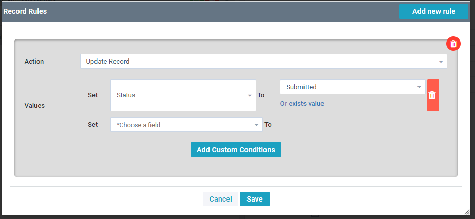
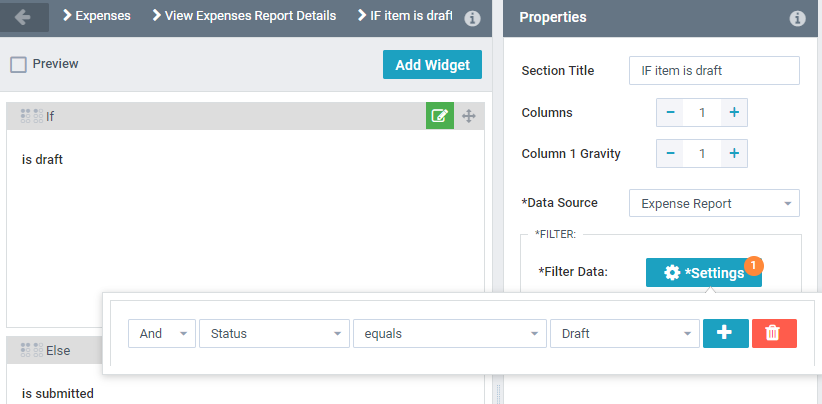
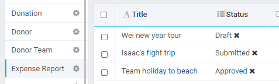
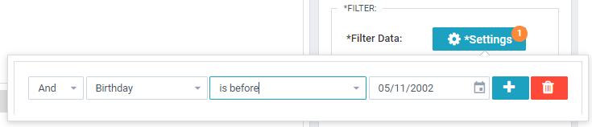
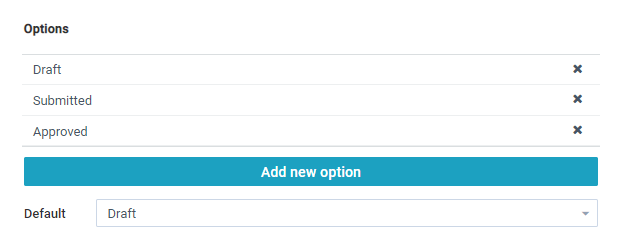
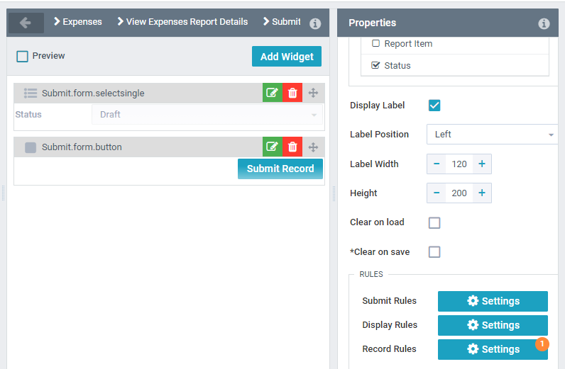

The conditional container allows to different items to be shown to a user based on a condition.

The condition container has two section called If and Else. You can edit each section an add widgets to them.

The **Data Source** and **Filter Data** determine whether If or Else is displayed.

If the current selection of the Data Collection (Data Source) passes the [filter](../../../concepts/filters/Filters.md) then **If** is displayed. Otherwise **Else** is displayed.

## Properties

**Data Source** - Data collection to use in the condition.

**Filter Data** - [Filter](../../../concepts/recordRules/RecordRules.md) as the condition of which container to display.

## useage

First, ask yourself if you should just have seperate pages and seperate data collections.
Maitenance on this widget shouldn't be taken lightly, so know what you're doing before commiting yourself to it.

A cursor has to be set on the data collection the conditional widget is checking – as it isn’t checking the whole object but rather the **single record** that happens to be the current selection in that collection.

For example: we make a conditional widget that checks if a person can vote. It depends on if their birthday makes them 18 on November 5th.

The ‘person’ data collection **must have a cursor set** before user would see it, either through user selecting a record or through a default on the data collection itself.

Lets say in the example that it’s a family HR app, and the user is selecting from a list of family members. For this, we show a grid or a data collection, which links to the sub-page with the conditional widget.

Now we just have to filter the data collection properly.

>>>>>  gd2md-html alert: inline image link here (to images/image1.png). Store image on your image server and adjust path/filename/extension if necessary.  (<a href="#">Back to top</a>)(<a href="#gdcalert2">Next alert</a>) >>>>> 

**Heres a more practical example:**

We want to have different widget options depending on the **status **of a selected record. The user has to click on an Expense Report to get here,  \
We split them off via a filter that checks the **Status**. Also note that we could give the user the ‘is draft’ view by adding additional filters -- and changing the filter to “**OR**” for example.  \
OR status == draft \
OR status == rejected

>>>>>  gd2md-html alert: inline image link here (to images/image2.png). Store image on your image server and adjust path/filename/extension if necessary.  (<a href="#">Back to top</a>)(<a href="#gdcalert3">Next alert</a>) >>>>> 

Here are some example Expense Reports with different Statuses

What is a Status? It is a select-list option. We could use checkboxes, but I think there could be different statuses in the future, so I’m using the more open-ended status option.  \
 \
**A very important part **of creating this select list is setting the **DEFAULT **option.  

We will also need a special form where a user can change the status -- but we need to lock it so the user can ONLY set the status to submitted. How? Record rules! \

First I make a form, and remove all fields, those I leave I disable. Don’t want the user to accidentally make changes at this point. The text on the ‘save’ button is customised to show what it does \

 \
And when the user clicks it, this is what is actually updated. \

