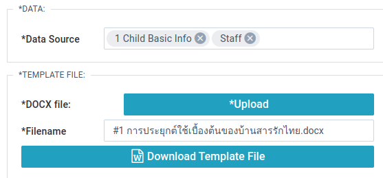
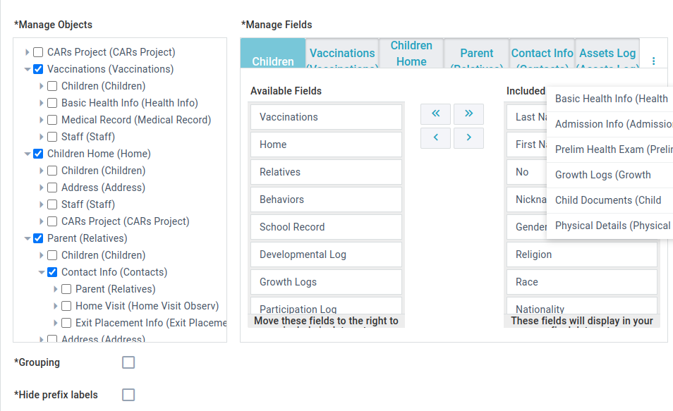

Adds a button to download a custom report made using a docx template.

## Templates

We use [docxtemplater](https://docxtemplater.com/) to create the reports.

### Single Data Source

Reference a field:\
`{field name}`

Loop through values:

```
{#field name}
  ...
{/field name}
```

### Multiple Data Sources

Pick a data source with looping syntax:

```
{#data collection 1}
  {field name 1}
  {field name 2}
  {field name 3}
{/data collection 1}

{#data collection 2}
  {field name 1}
  {field name 2}
  {field name 3}
{/data collection 2}
```

### Special Tags

Insert an image:\
`{%image field}`

Insert the Sum of a field:\
`{$sum?number field}`

See [docxtemplater](https://docxtemplater.com/) for examples and advanced use.

## Properties

### Data

**Data Source** - Choose the data collections to load into the docx template. Unlike other widgets multiple data sources can be added.

### Template File

**DOCX file** - Upload your template file.

**Filename** - Change the filename for the reports created and downloaded.

### Language

**Language** -

> TODO - what does this change?

### Customize Display:

**Label** - Change the text shown on the report download button.

**Width** - Adjust the button width

**Page background** - Change the widget background color.

**Button Position** - Choose to position the button left, center, or right.

## Example usage:
Here is an example of the most complicated docx report at time of writing.
It is not recommended that you build something similar, it is much better to use data collections here: 


[Report:](files/#1การประยุกต์ใช้เบื้องต้นของบ้านสารรักไทย.docx) <a href="https://github.com/CruGlobal/appbuilder_docs/raw/master/user/uiBuilder/widgets/docx/files/%231%E0%B8%81%E0%B8%B2%E0%B8%A3%E0%B8%9B%E0%B8%A3%E0%B8%B0%E0%B8%A2%E0%B8%B8%E0%B8%81%E0%B8%95%E0%B9%8C%E0%B9%83%E0%B8%8A%E0%B9%89%E0%B9%80%E0%B8%9A%E0%B8%B7%E0%B9%89%E0%B8%AD%E0%B8%87%E0%B8%95%E0%B9%89%E0%B8%99%E0%B8%82%E0%B8%AD%E0%B8%87%E0%B8%9A%E0%B9%89%E0%B8%B2%E0%B8%99%E0%B8%AA%E0%B8%B2%E0%B8%A3%E0%B8%A3%E0%B8%B1%E0%B8%81%E0%B9%84%E0%B8%97%E0%B8%A2.docx" target="_blank" download>Click here to download</a>


This is the query the report is based on:

