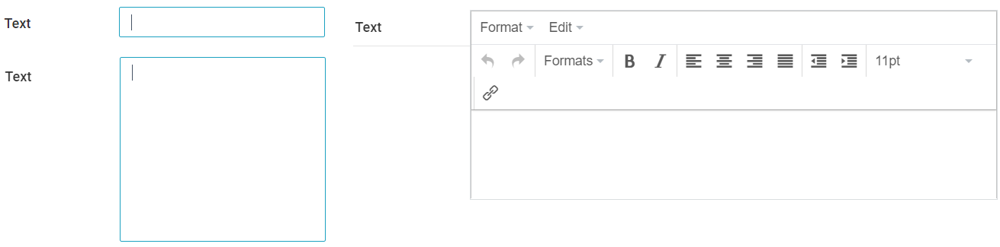
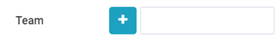
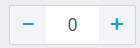
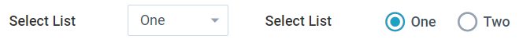

Displays a form that user can use to edit or add records. After selecting a data collection. A widget for each field is added to the workspace. Each field has its own properties. [Label widgets](../label/Label.md) can also be added to customize the form.

## Properties

**Columns** - Adjust the number of columns.

**Column 1 Gravity** - Adjust a columns width relative to other columns

**Data Source** - Select the Data Collection that the form will add to or exit from

**Form Fields** - Unselect any fields to remove them from the form.

**Display Label** - Unselect to hide labels beside each field.

**Label Position** - Choose to display the labels to Left or above the input.

**Label Width** - Adjust the space to the left for the label. Setting this short will cut off longer labels

**Height** - Adjust the height of the widget.

> Has no effect currently?

**Clear on load** - Select to clear the selection on the data collection when loading the form. This will load the form blank, which is what you want when adding new records. For editing existing records leave this unchecked.

**Clear on save** - Select to clear the selection on the data collection after submitting the form.

### Rules

**Submit Rules** - Add rules to determine what happens in the user interface after submitting the for. Conditions can be added to apply different actions based on the form response. Multiple rules can be added. Each rule has 3 parts:

- **Action**
  - **Show a confirmation message** - Display a custom message in a popup
  - **Redirect to an existing page** - Take the user to another page
  - **Redirect to the parent page** - Take the user to the parent page of the form page
  - **Close the current popup** - If the form is in a popup use this action to close the popup
  - **Redirect to another website URL** - Take the user to an external website
  - **Send a custom email** - Sends an email in response to the form
- **Value** - This section depending on the action selected will ask for a message, page, website or custom email message.
- **When** - Use [filters](../../../concepts/filters/Filters.md) to add conditions for the action based on the response values.

**Display Rules** - Not used currently

> TODO: Should we remove this option?

**Record Rules** - Modify the record or a connected record after submitting based on conditions. [Learn more about record rules.](../../../concepts/recordRules/RecordRules.md)

## Button

A form button widget is included in the form. Using the edit button beside shows additional properties

### Properties

**Save** - Unselect to hide the Save button. Using the save button submits the form. Without a save button the form is read only.

**Save Label** - Change the text displayed on the Save button.

**Cancel** - Select to add a Cancel button. This closes the form, discarding any changes made.

**Cancel Label** - Change the text displayed on the Cancel button.

**Reset** - Select to add a reset button. This will clear the form while keeping it open.

**Reset Label** - Change the text displayed on the Reset button.

**After Cancel** - Choose which page to take users to when using the cancel button.

**Alignment** - Choose to display the button group left, center or right.

## Field Properties

By using the edit button beside a field, more properties are available. These two properties are common to all field types. Certain field types have extra properties.

**Required** - Select to make the field a required field.
_Note: If the field is set to required in the Object definition, it will be set to required here with no option to unselect._

**Disable** - Select this if you want the user to see the value, but not allow changes. The field will appear greyed out in the form, and cannot be edited.

#### Textbox

**Type** - Set the textbox type: Single line, Multiple Lines, Rich editor

#### Connected Records

**Add New Form/Edit Form** - Link an add or edit page for the connected record.\

**Filter Options** - Use [filters](../../../concepts/filters/Filters.md) to exclude records as options when filling out the form

#### Number Box

**Plus/Minus Buttons** - Select to show a plus and minus button on each side of the number box.\

#### Select list

**Type** - Choose between a drop down select list and radio

