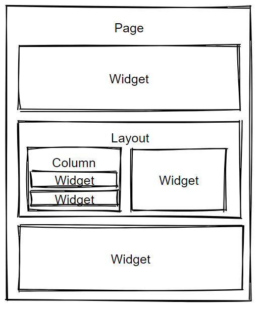

This widget is container used to arrange other widgets allowing for complex page layouts. Widgets added to the layout are displayed in line horizontally.

In the properties panel use **Add Column** to create a view container inside the layout. The view container can contain multiple widgets.

## Example Use

