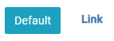
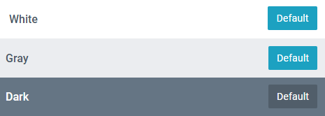
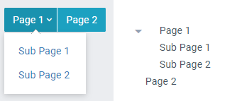

Displays a menu bar with a title and links to other pages.

## Properties

**Orientation** - Choose to display the menu horizontally or vertically.

**Button Style** - Choose the button style.\

**Menu Alignment** - Choose whether to align the menu Left, Center or Right.\
_Note: When using the toolbar, **Menu Position** decides in which region (left, center or right) the menu displays. Alignment adjusts within the region. In most cases using the same choice for each setting is best._

**Put menu in toolbar** - Unselect to display the menu without a toolbar.

### Toolbar Settings

**Toolbar padding** - Adjust the extra space added to the toolbar around the content.

**Toolbar theme** - Select the theme to use.\

**Menu Position** - Choose where the menu displays (see note on alignment).

**Text Left/Center/Right** - add text to display in the toolbar.\
_Note: the menu will cover text in the selected position._

### Page list

Select the pages to display. Click to change the name displayed, enter to save. Changing the name does not rename the page, only the text on the menu.

### Drag and Drop

Further customize the menu by dragging pages to reorder them or to group it underneath another page.\
\
Click a page to choose an icon for improved
