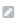

The tab widgets display a set of tabs. Each tab can contain it's own set of widgets.

## Editing

When editing the tab widget a list of tabs is displayed. Use the properties panel to add a tab. Reorder tabs with the arrows beside the names. Edit the tab name and icon with the edit button  beside the name.

To add widget or edit a tab, select it from the tab bar. Then use the green edit button in the top right .

## Properties

**Height** - Adjust the height of the widget

**Minimum width** - Adjust the minimum width of the widget

**Stack Tabs Vertically** - By default the tab bar is horizontal across the top, select to switch to a vertical tab bar.

**Position icon above text** - By default an icon is placed to the left of the tab names, select to place it above. _Only an options for horizontally stacked tabs._

**Use Dark Theme** - Select to switch to the dark theme.

**Width of Sidebar** - Adjust the sidebar width. _Only an options for vertically stacked tabs._

**Position of Sidebar** - Choose to show the sidebar on the left right. _Only an options for vertically stacked tabs._

**Add Tab** - Select to add a new tab to the group. Enter the tab name, choose an icon, then press Add in the pop up.
